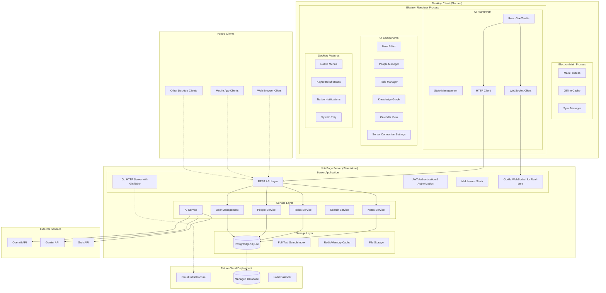

# Design Document

## Overview

NoteSage is a multi-platform knowledge management solution designed with a desktop-first approach that will eventually expand to web (GCP-hosted), Android, and iOS clients. The current focus is on building a robust desktop application with offline-first capabilities, which will serve as the foundation for future platform expansions.

The application uses a hybrid architecture where notes are stored as markdown files (Obsidian-like approach) while metadata and relationships are managed through SQLite for optimal performance and data portability. This architecture is designed to support both local storage (desktop offline) and cloud synchronization (web/mobile) while maintaining the desktop's offline-first advantage.

The design prioritizes:
- **Client-server separation** with clean API boundaries for maximum flexibility
- **Multi-user support** through standalone server with proper authentication and authorization
- **Deployment flexibility** allowing server to run locally or in cloud with no code changes
- **Offline-first desktop experience** with local caching and sync capabilities
- **Cross-platform compatibility** through standardized REST APIs that work for all client types
- **Data ownership and control** with local server installation as the primary offering

## Architecture

### Separated Client-Server Architecture

The application uses a clean client-server architecture with separate desktop client and standalone server:



### Multi-Platform Strategy

**Phase 1: Desktop Client + Standalone Server (Current Focus)**
- Build desktop client application (Electron-based for Ubuntu Linux & macOS)
- Build standalone NoteSage server (Go with Gin/Echo framework for Ubuntu)
- Create installers and auto-update systems for both client and server
- Establish clean client-server separation via REST API
- Server supports multiple concurrent users
- Automated installation, configuration, and upgrade processes

**Phase 2: Multi-Platform Clients (Future)**
- Web client connecting to same server API
- Android and iOS native clients
- All clients connect to same server instance
- Server remains unchanged across client platforms

**Phase 3: Cloud Deployment (Future)**
- Lift-and-shift same server package to cloud infrastructure
- No code changes needed in server or clients
- Cloud deployment with managed database
- Enterprise hosting and scaling options

### Standalone Server Architecture

**NoteSage Server (Go Binary):**
- **Single binary deployment**: Compiled Go binary with no external dependencies
- **Multi-user support**: JWT-based authentication and authorization for multiple users
- **Database management**: GORM for PostgreSQL/SQLite database operations
- **REST API**: High-performance HTTP API using Gin or Echo framework
- **WebSocket support**: Gorilla WebSocket for real-time collaborative features
- **Cross-platform**: Single codebase compiles to Windows, macOS, Linux binaries (Ubuntu primary target)

**Database Strategy:**
- **PostgreSQL**: Primary choice for multi-user scenarios with full-text search
- **SQLite**: Alternative for single-user or simple deployments
- **GORM**: Go ORM for database operations with automatic migrations
- **Structured data**: Notes, todos, people, relationships as database records
- **Rich content**: Note content stored as structured JSON for rich editing
- **Full-text search**: PostgreSQL built-in search or SQLite FTS5
- **ACID transactions**: Data consistency and integrity guaranteed

**Client-Server Communication:**
- **HTTP REST API**: All CRUD operations via standard REST endpoints
- **Gorilla WebSocket**: Real-time updates and collaborative editing
- **JWT Authentication**: Stateless token-based authentication
- **Offline support**: Desktop client caches data for offline operation
- **Sync mechanism**: Automatic synchronization when connection restored
- **API versioning**: Backward compatibility through versioned endpoints

**Multi-Client Architecture:**
- **Desktop client**: Electron app connects via HTTP/WebSocket
- **Future web client**: Browser-based client using same API
- **Mobile clients**: iOS/Android apps connect to same endpoints
- **API versioning**: Backward compatibility for different client versions

**Deployment Flexibility:**
- **Single binary**: Download and run one executable file
- **Primary target**: Ubuntu Linux server deployment
- **Cross-compilation**: Build binaries for Windows, macOS, Linux from CI/CD
- **Local installation**: Install on local machine or network server
- **Network access**: Multiple users connect to same server instance
- **Cloud deployment**: Same binary runs in cloud with environment config
- **Docker support**: Ubuntu-based containerized deployment for easy scaling
- **Configuration**: Environment variables and config files for different scenarios

**Data Management:**
- **User isolation**: Each user's data properly isolated and secured
- **Backup/restore**: Database backup and restore functionality
- **Export/import**: Data portability tools for migration
- **Admin interface**: Server administration and user management tools

### Go Technology Stack

**Core Framework:**
```go
// Web Framework: Gin (high performance) or Echo (feature-rich)
router := gin.Default()
router.POST("/api/notes", createNote)
router.GET("/api/notes/:id", getNote)
router.PUT("/api/notes/:id", updateNote)
router.DELETE("/api/notes/:id", deleteNote)
```

**Database Layer:**
```go
// GORM for database operations
type Note struct {
    ID        uuid.UUID `gorm:"type:uuid;primary_key;default:gen_random_uuid()"`
    UserID    uuid.UUID `gorm:"type:uuid;not null"`
    Title     string    `gorm:"not null"`
    Content   JSON      `gorm:"type:jsonb"`
    Category  string    `gorm:"default:'Note'"`
    Tags      pq.StringArray `gorm:"type:text[]"`
    CreatedAt time.Time
    UpdatedAt time.Time
}
```

**Authentication:**
```go
// JWT middleware for authentication
func AuthMiddleware() gin.HandlerFunc {
    return gin.HandlerFunc(func(c *gin.Context) {
        token := c.GetHeader("Authorization")
        claims, err := validateJWT(token)
        if err != nil {
            c.JSON(401, gin.H{"error": "Unauthorized"})
            c.Abort()
            return
        }
        c.Set("userID", claims.UserID)
        c.Next()
    })
}
```

**WebSocket Support:**
```go
// Gorilla WebSocket for real-time features
var upgrader = websocket.Upgrader{
    CheckOrigin: func(r *http.Request) bool { return true },
}

func handleWebSocket(c *gin.Context) {
    conn, err := upgrader.Upgrade(c.Writer, c.Request, nil)
    if err != nil {
        return
    }
    defer conn.Close()
    
    // Handle real-time note updates
    for {
        var msg Message
        err := conn.ReadJSON(&msg)
        if err != nil {
            break
        }
        // Broadcast to other connected clients
        broadcastToRoom(msg.RoomID, msg)
    }
}
```

**Key Go Libraries:**
- **Gin/Echo**: Web framework for REST API
- **GORM**: ORM for database operations
- **Gorilla WebSocket**: WebSocket support for real-time features
- **JWT-Go**: JWT token handling
- **Viper**: Configuration management
- **Logrus**: Structured logging
- **Testify**: Testing framework
- **Air**: Hot reload for development

### Installation and Upgrade System

**Desktop Client Installers (Ubuntu & macOS):**

*Ubuntu Linux (.deb package):*
```bash
# Package structure
notesage-desktop_1.0.0_amd64.deb
├── DEBIAN/
│   ├── control          # Package metadata
│   ├── postinst         # Post-installation script
│   ├── prerm           # Pre-removal script
│   └── postrm          # Post-removal script
├── usr/
│   ├── bin/
│   │   └── notesage-desktop
│   ├── share/
│   │   ├── applications/
│   │   │   └── notesage.desktop
│   │   └── icons/
│   │       └── notesage.png
│   └── lib/
│       └── notesage/
│           └── resources/
```

*macOS (.dmg installer):*
```bash
# Package structure
NoteSage-1.0.0.dmg
├── NoteSage.app/
│   ├── Contents/
│   │   ├── Info.plist
│   │   ├── MacOS/
│   │   │   └── NoteSage
│   │   └── Resources/
│   │       └── app.asar
└── Applications (symlink)
```

**Server Installer (Ubuntu):**

*Installation Script:*
```bash
#!/bin/bash
# notesage-server-install.sh

set -e

# Check system requirements
check_requirements() {
    echo "Checking system requirements..."
    
    # Check Ubuntu version
    if ! lsb_release -d | grep -q "Ubuntu"; then
        echo "Error: This installer requires Ubuntu Linux"
        exit 1
    fi
    
    # Check for required packages
    command -v systemctl >/dev/null 2>&1 || { echo "systemd required"; exit 1; }
}

# Install PostgreSQL if needed
install_database() {
    echo "Setting up database..."
    
    if ! command -v psql >/dev/null 2>&1; then
        sudo apt update
        sudo apt install -y postgresql postgresql-contrib
        sudo systemctl enable postgresql
        sudo systemctl start postgresql
    fi
    
    # Create notesage database and user
    sudo -u postgres createdb notesage 2>/dev/null || true
    sudo -u postgres createuser notesage 2>/dev/null || true
    sudo -u postgres psql -c "ALTER USER notesage WITH PASSWORD 'notesage_default_password';"
    sudo -u postgres psql -c "GRANT ALL PRIVILEGES ON DATABASE notesage TO notesage;"
}

# Install NoteSage server
install_server() {
    echo "Installing NoteSage server..."
    
    # Create notesage user
    sudo useradd -r -s /bin/false notesage 2>/dev/null || true
    
    # Create directories
    sudo mkdir -p /opt/notesage
    sudo mkdir -p /etc/notesage
    sudo mkdir -p /var/log/notesage
    sudo mkdir -p /var/lib/notesage
    
    # Copy binary
    sudo cp notesage-server /opt/notesage/
    sudo chmod +x /opt/notesage/notesage-server
    
    # Copy configuration
    sudo cp config.yaml /etc/notesage/
    
    # Set permissions
    sudo chown -R notesage:notesage /var/log/notesage
    sudo chown -R notesage:notesage /var/lib/notesage
    sudo chown -R root:notesage /etc/notesage
    sudo chmod 640 /etc/notesage/config.yaml
}

# Create systemd service
create_service() {
    echo "Creating systemd service..."
    
    sudo tee /etc/systemd/system/notesage.service > /dev/null <<EOF
[Unit]
Description=NoteSage Server
After=network.target postgresql.service
Requires=postgresql.service

[Service]
Type=simple
User=notesage
Group=notesage
WorkingDirectory=/opt/notesage
ExecStart=/opt/notesage/notesage-server --config /etc/notesage/config.yaml
Restart=always
RestartSec=5
StandardOutput=journal
StandardError=journal

[Install]
WantedBy=multi-user.target
EOF

    sudo systemctl daemon-reload
    sudo systemctl enable notesage
}

# Main installation
main() {
    check_requirements
    install_database
    install_server
    create_service
    
    echo "NoteSage server installed successfully!"
    echo "Start with: sudo systemctl start notesage"
    echo "Check status: sudo systemctl status notesage"
    echo "View logs: sudo journalctl -u notesage -f"
}

main "$@"
```

**Auto-Update System:**

*Desktop Client (Electron-updater):*
```typescript
class AutoUpdater {
    private updater: AppUpdater;
    
    constructor() {
        this.updater = autoUpdater;
        this.setupUpdateHandlers();
    }
    
    private setupUpdateHandlers(): void {
        this.updater.checkForUpdatesAndNotify();
        
        this.updater.on('update-available', (info) => {
            this.showUpdateNotification(info);
        });
        
        this.updater.on('update-downloaded', () => {
            this.showRestartDialog();
        });
        
        this.updater.on('error', (error) => {
            console.error('Update error:', error);
        });
    }
    
    async checkForUpdates(): Promise<void> {
        try {
            await this.updater.checkForUpdates();
        } catch (error) {
            console.error('Failed to check for updates:', error);
        }
    }
    
    async downloadUpdate(): Promise<void> {
        await this.updater.downloadUpdate();
    }
    
    restartAndInstall(): void {
        this.updater.quitAndInstall();
    }
}
```

*Server Update Script:*
```bash
#!/bin/bash
# notesage-server-update.sh

set -e

CURRENT_VERSION=$(notesage-server --version 2>/dev/null || echo "unknown")
LATEST_VERSION=$(curl -s https://api.github.com/repos/notesage/server/releases/latest | jq -r .tag_name)

if [ "$CURRENT_VERSION" != "$LATEST_VERSION" ]; then
    echo "Updating NoteSage server from $CURRENT_VERSION to $LATEST_VERSION"
    
    # Stop service
    sudo systemctl stop notesage
    
    # Backup current binary
    sudo cp /opt/notesage/notesage-server /opt/notesage/notesage-server.backup
    
    # Download new version
    wget -O /tmp/notesage-server "https://github.com/notesage/server/releases/latest/download/notesage-server-linux-amd64"
    
    # Install new binary
    sudo cp /tmp/notesage-server /opt/notesage/notesage-server
    sudo chmod +x /opt/notesage/notesage-server
    
    # Run database migrations
    sudo -u notesage /opt/notesage/notesage-server migrate --config /etc/notesage/config.yaml
    
    # Start service
    sudo systemctl start notesage
    
    echo "Update completed successfully!"
else
    echo "NoteSage server is already up to date ($CURRENT_VERSION)"
fi
```

**Configuration Management:**

*Server Configuration (YAML):*
```yaml
# /etc/notesage/config.yaml
server:
  host: "0.0.0.0"
  port: 8080
  tls:
    enabled: false
    cert_file: ""
    key_file: ""

database:
  type: "postgres"  # or "sqlite"
  host: "localhost"
  port: 5432
  name: "notesage"
  user: "notesage"
  password: "notesage_default_password"
  ssl_mode: "disable"

auth:
  jwt_secret: "your-jwt-secret-here"
  session_timeout: "24h"

logging:
  level: "info"
  file: "/var/log/notesage/server.log"
  max_size: 100  # MB
  max_backups: 5

features:
  ai_enabled: true
  websocket_enabled: true
  file_uploads: true
  max_upload_size: "10MB"
```

### Database Schema Structure

**Cloud Database (PostgreSQL):**
```sql
-- Notes table with rich content
CREATE TABLE notes (
    id UUID PRIMARY KEY DEFAULT gen_random_uuid(),
    user_id UUID NOT NULL,
    title TEXT NOT NULL,
    content JSONB NOT NULL, -- Rich content as structured JSON
    category TEXT DEFAULT 'Note',
    tags TEXT[] DEFAULT '{}',
    folder_path TEXT DEFAULT '/',
    scheduled_date TIMESTAMPTZ,
    is_archived BOOLEAN DEFAULT FALSE,
    is_pinned BOOLEAN DEFAULT FALSE,
    is_favorite BOOLEAN DEFAULT FALSE,
    created_at TIMESTAMPTZ DEFAULT NOW(),
    updated_at TIMESTAMPTZ DEFAULT NOW(),
    version INTEGER DEFAULT 1
);

-- Todos with unique IDs
CREATE TABLE todos (
    id UUID PRIMARY KEY DEFAULT gen_random_uuid(),
    note_id UUID NOT NULL REFERENCES notes(id) ON DELETE CASCADE,
    todo_id TEXT NOT NULL, -- e.g., "t1", "t2"
    text TEXT NOT NULL,
    is_completed BOOLEAN DEFAULT FALSE,
    assigned_person_id UUID REFERENCES people(id),
    due_date DATE,
    created_at TIMESTAMPTZ DEFAULT NOW(),
    updated_at TIMESTAMPTZ DEFAULT NOW(),
    UNIQUE(note_id, todo_id)
);

-- People management
CREATE TABLE people (
    id UUID PRIMARY KEY DEFAULT gen_random_uuid(),
    user_id UUID NOT NULL,
    name TEXT NOT NULL,
    email TEXT,
    phone TEXT,
    company TEXT,
    title TEXT,
    linkedin_url TEXT,
    avatar_url TEXT,
    notes TEXT,
    created_at TIMESTAMPTZ DEFAULT NOW(),
    updated_at TIMESTAMPTZ DEFAULT NOW()
);
```

**Desktop Cache (SQLite):**
```sql
-- Identical schema to cloud database for consistency
-- Additional sync metadata
CREATE TABLE sync_metadata (
    table_name TEXT PRIMARY KEY,
    last_sync DATETIME DEFAULT CURRENT_TIMESTAMP,
    sync_token TEXT
);

CREATE TABLE offline_queue (
    id INTEGER PRIMARY KEY,
    operation TEXT NOT NULL, -- 'create', 'update', 'delete'
    table_name TEXT NOT NULL,
    record_id TEXT NOT NULL,
    data TEXT, -- JSON
    created_at DATETIME DEFAULT CURRENT_TIMESTAMP
);
```

### Note Content Structure

**Rich Content JSON Format:**
```json
{
  "type": "doc",
  "content": [
    {
      "type": "heading",
      "attrs": { "level": 1 },
      "content": [{ "type": "text", "text": "Team Standup - January 15, 2024" }]
    },
    {
      "type": "paragraph",
      "content": [
        { "type": "text", "text": "Attendees: " },
        { "type": "mention", "attrs": { "type": "person", "id": "john-smith" } },
        { "type": "text", "text": ", " },
        { "type": "mention", "attrs": { "type": "person", "id": "sarah-johnson" } }
      ]
    },
    {
      "type": "todo",
      "attrs": { "todoId": "t1", "completed": true, "assignedTo": "john-smith", "dueDate": "2024-01-14" },
      "content": [{ "type": "text", "text": "Complete API documentation" }]
    },
    {
      "type": "mermaid",
      "attrs": { "code": "graph LR\n    A[Requirements] --> B[Design]" }
    }
  ]
}
```

## Components and Interfaces

### Core Components

#### 0. Desktop Client Architecture

**Electron Application Structure:**
```
Desktop Client/
├── main/                    # Electron main process
│   ├── main.js             # Application entry point
│   ├── server-manager.js   # Server connection management
│   ├── offline-cache.js    # Local SQLite cache
│   └── sync-manager.js     # Sync with server
├── renderer/               # Electron renderer process
│   ├── components/         # React/Vue components
│   ├── services/          # API client services
│   ├── stores/            # State management
│   └── utils/             # Utility functions
└── shared/                # Shared types and constants
```

**Server Connection Management:**
```typescript
class ServerConnectionManager {
    private connections: Map<string, ServerConnection> = new Map();
    private activeConnection: ServerConnection | null = null;
    
    async connectToServer(profile: ServerProfile): Promise<void> {
        const connection = new ServerConnection(profile);
        await connection.authenticate();
        this.connections.set(profile.id, connection);
        this.activeConnection = connection;
    }
    
    async switchServer(profileId: string): Promise<void> {
        const connection = this.connections.get(profileId);
        if (connection) {
            this.activeConnection = connection;
            await this.syncManager.syncWithNewServer(connection);
        }
    }
}
```

**Offline Cache System:**
```typescript
class OfflineCache {
    private db: SQLiteDatabase;
    
    async cacheNote(note: Note): Promise<void> {
        await this.db.run(`
            INSERT OR REPLACE INTO cached_notes 
            (id, title, content, updated_at, server_id) 
            VALUES (?, ?, ?, ?, ?)
        `, [note.id, note.title, note.content, note.updatedAt, this.serverId]);
    }
    
    async getOfflineNotes(): Promise<Note[]> {
        return await this.db.all('SELECT * FROM cached_notes ORDER BY updated_at DESC');
    }
}
```

#### 1. Cloud Sync Manager

**Cloud Sync Service:**
```typescript
class CloudSyncManager {
    private cloudAPI: CloudAPI;
    private localCache: SQLiteCache;
    private offlineQueue: OfflineQueue;
    private isOnline: boolean = true;
    
    constructor() {
        this.cloudAPI = new CloudAPI();
        this.localCache = new SQLiteCache();
        this.offlineQueue = new OfflineQueue();
        this.setupConnectionMonitoring();
    }
    
    async createNote(note: CreateNoteRequest): Promise<Note> {
        // Always update local cache first (optimistic update)
        const localNote = await this.localCache.createNote(note);
        
        if (this.isOnline) {
            try {
                // Sync to cloud immediately
                const cloudNote = await this.cloudAPI.createNote(note);
                await this.localCache.updateNote(cloudNote.id, cloudNote);
                return cloudNote;
            } catch (error) {
                // Queue for later sync if cloud fails
                await this.offlineQueue.enqueue('create', 'notes', localNote);
                return localNote;
            }
        } else {
            // Queue for sync when online
            await this.offlineQueue.enqueue('create', 'notes', localNote);
            return localNote;
        }
    }
    
    async updateNote(noteId: string, updates: UpdateNoteRequest): Promise<Note> {
        // Update local cache immediately
        const localNote = await this.localCache.updateNote(noteId, updates);
        
        if (this.isOnline) {
            try {
                const cloudNote = await this.cloudAPI.updateNote(noteId, updates);
                await this.localCache.updateNote(noteId, cloudNote);
                return cloudNote;
            } catch (error) {
                await this.offlineQueue.enqueue('update', 'notes', localNote);
                return localNote;
            }
        } else {
            await this.offlineQueue.enqueue('update', 'notes', localNote);
            return localNote;
        }
    }
    
    async syncPendingChanges(): Promise<SyncResult> {
        if (!this.isOnline) return { success: false, reason: 'offline' };
        
        const pendingOperations = await this.offlineQueue.getAllPending();
        const results: SyncResult = { synced: 0, failed: 0, conflicts: 0 };
        
        for (const operation of pendingOperations) {
            try {
                await this.syncOperation(operation);
                await this.offlineQueue.markCompleted(operation.id);
                results.synced++;
            } catch (error) {
                if (this.isConflictError(error)) {
                    await this.handleConflict(operation, error);
                    results.conflicts++;
                } else {
                    results.failed++;
                }
            }
        }
        
        return results;
    }
    
    private async handleConflict(operation: OfflineOperation, error: ConflictError): Promise<void> {
        // Simple conflict resolution: show user both versions
        const resolution = await this.showConflictResolution(operation, error);
        
        switch (resolution.strategy) {
            case 'keep_local':
                await this.cloudAPI.forceUpdate(operation.recordId, operation.data);
                break;
            case 'keep_remote':
                await this.localCache.updateFromCloud(operation.recordId, error.remoteData);
                break;
            case 'merge':
                const merged = await this.mergeData(operation.data, error.remoteData);
                await this.cloudAPI.updateNote(operation.recordId, merged);
                await this.localCache.updateNote(operation.recordId, merged);
                break;
        }
    }
}
```

#### 2. Todo Management System

**Database-First Todo Manager:**
```typescript
class TodoManager {
    private cloudSync: CloudSyncManager;
    private localCache: SQLiteCache;
    
    async createTodo(noteId: string, text: string, assignedPersonId?: string, dueDate?: Date): Promise<Todo> {
        // Generate next todo ID for the note
        const todoId = await this.generateNextTodoId(noteId);
        
        const todo: CreateTodoRequest = {
            noteId,
            todoId,
            text,
            isCompleted: false,
            assignedPersonId,
            dueDate
        };
        
        // Create through cloud sync (handles offline/online automatically)
        const createdTodo = await this.cloudSync.createTodo(todo);
        
        // Update note content to include the todo
        await this.updateNoteWithTodo(noteId, createdTodo);
        
        return createdTodo;
    }
    
    async updateTodoStatus(todoId: string, isCompleted: boolean): Promise<Todo> {
        // Update todo in database
        const updatedTodo = await this.cloudSync.updateTodo(todoId, { isCompleted });
        
        // Update note content to reflect the change
        await this.updateNoteWithTodo(updatedTodo.noteId, updatedTodo);
        
        return updatedTodo;
    }
    
    async getTodosForNote(noteId: string): Promise<Todo[]> {
        // Get from local cache first (fast)
        return await this.localCache.getTodosByNoteId(noteId);
    }
    
    async getAllTodos(filters?: TodoFilters): Promise<Todo[]> {
        let query = this.localCache.query('todos');
        
        if (filters?.isCompleted !== undefined) {
            query = query.where('is_completed', filters.isCompleted);
        }
        
        if (filters?.assignedPersonId) {
            query = query.where('assigned_person_id', filters.assignedPersonId);
        }
        
        if (filters?.dueDateRange) {
            query = query.whereBetween('due_date', [
                filters.dueDateRange.start,
                filters.dueDateRange.end
            ]);
        }
        
        return await query.orderBy('created_at', 'desc');
    }
    
    async syncTodos(): Promise<SyncResult> {
        // Manual sync trigger - sync all pending todo changes
        return await this.cloudSync.syncPendingChanges('todos');
    }
    
    private async generateNextTodoId(noteId: string): Promise<string> {
        const existingTodos = await this.getTodosForNote(noteId);
        const existingIds = existingTodos
            .map(t => parseInt(t.todoId.substring(1))) // Remove 't' prefix
            .filter(id => !isNaN(id));
        
        const nextId = Math.max(0, ...existingIds) + 1;
        return `t${nextId}`;
    }
    
    private async updateNoteWithTodo(noteId: string, todo: Todo): Promise<void> {
        // Update the note's content to reflect todo changes
        const note = await this.localCache.getNote(noteId);
        const updatedContent = this.updateTodoInNoteContent(note.content, todo);
        
        await this.cloudSync.updateNote(noteId, { content: updatedContent });
    }
    
    private updateTodoInNoteContent(content: any, todo: Todo): any {
        // Find and update the todo in the structured content
        return this.traverseContent(content, (node) => {
            if (node.type === 'todo' && node.attrs?.todoId === todo.todoId) {
                return {
                    ...node,
                    attrs: {
                        ...node.attrs,
                        completed: todo.isCompleted,
                        assignedTo: todo.assignedPersonId,
                        dueDate: todo.dueDate
                    }
                };
            }
            return node;
        });
    }
    
    private traverseContent(content: any, transformer: (node: any) => any): any {
        if (Array.isArray(content)) {
            return content.map(item => this.traverseContent(item, transformer));
        }
        
        if (content && typeof content === 'object') {
            const transformed = transformer(content);
            
            if (transformed.content) {
                transformed.content = this.traverseContent(transformed.content, transformer);
            }
            
            return transformed;
        }
        
        return content;
    }
}
```

#### 1. Rich Text Editor Component

**Editor Architecture (TipTap/ProseMirror-based):**
```typescript
class RichTextEditor {
    private editor: Editor;
    private slashCommands: SlashCommand[];
    private autoCompleteProviders: AutoCompleteProvider[];
    private versionHistory: VersionHistoryManager;
    
    constructor() {
        this.initializeEditor();
        this.initializeSlashCommands();
        this.initializeAutoComplete();
        this.versionHistory = new VersionHistoryManager();
    }
    
    private initializeEditor(): void {
        this.editor = new Editor({
            extensions: [
                StarterKit,
                Table.configure({ resizable: true }),
                CodeBlockLowlight.configure({ lowlight }),
                Image,
                Link,
                Mention.configure({
                    HTMLAttributes: { class: 'mention' },
                    suggestion: this.mentionSuggestion
                }),
                TaskList,
                TaskItem.configure({ nested: true }),
                Collaboration.configure({ document: this.ydoc }),
                CollaborationCursor.configure({ provider: this.provider })
            ],
            content: this.initialContent,
            onUpdate: ({ editor }) => {
                this.handleContentChange(editor.getJSON());
            }
        });
    }
    
    private initializeSlashCommands(): void {
        this.slashCommands = [
            {
                trigger: '/table',
                description: 'Insert table',
                icon: 'table',
                action: () => this.insertTable()
            },
            {
                trigger: '/code',
                description: 'Insert code block',
                icon: 'code',
                action: () => this.insertCodeBlock()
            },
            {
                trigger: '/callout',
                description: 'Insert callout block',
                icon: 'info',
                action: () => this.insertCallout()
            },
            {
                trigger: '/mermaid',
                description: 'Insert mermaid diagram',
                icon: 'diagram',
                action: () => this.insertMermaidDiagram()
            },
            {
                trigger: '/todo',
                description: 'Insert todo item',
                icon: 'check',
                action: () => this.insertTodo()
            },
            {
                trigger: '/template',
                description: 'Insert template',
                icon: 'template',
                action: () => this.showTemplateSelector()
            }
        ];
    }
    
    private initializeAutoComplete(): void {
        this.autoCompleteProviders = [
            new PersonMentionProvider(), // @mentions
            new NoteReferenceProvider(), // #references
            new TagProvider(), // #tags
            new DateProvider() // Smart date completion
        ];
    }
    
    async insertTodo(): Promise<void> {
        const nextId = await this.todoManager.generateNextTodoId(this.currentNoteId);
        const todoNode = {
            type: 'taskItem',
            attrs: { 
                todoId: nextId,
                checked: false 
            },
            content: [{ type: 'paragraph' }]
        };
        
        this.editor.chain().focus().insertContent(todoNode).run();
    }
    
    // Version History Management
    async saveVersion(content: any, changeDescription?: string): Promise<void> {
        await this.versionHistory.saveVersion({
            noteId: this.currentNoteId,
            content: content,
            description: changeDescription || 'Auto-save',
            timestamp: new Date()
        });
    }
    
    async showVersionHistory(): Promise<void> {
        const versions = await this.versionHistory.getVersions(this.currentNoteId);
        this.versionHistoryModal.show(versions);
    }
    
    // Export Functionality
    async exportNote(format: 'pdf' | 'markdown' | 'html'): Promise<void> {
        const content = this.editor.getJSON();
        
        switch (format) {
            case 'markdown':
                const markdown = this.convertToMarkdown(content);
                await this.downloadFile(`${this.noteTitle}.md`, markdown);
                break;
            case 'html':
                const html = this.editor.getHTML();
                await this.downloadFile(`${this.noteTitle}.html`, html);
                break;
            case 'pdf':
                await this.generatePDF(content);
                break;
        }
    }
}

// Template System
class TemplateManager {
    async createTemplate(name: string, content: any, category: string): Promise<Template> {
        const template: Template = {
            id: generateUUID(),
            name,
            content,
            category,
            variables: this.extractVariables(content),
            createdAt: new Date()
        };
        
        await this.apiClient.post('/api/templates', template);
        return template;
    }
    
    async applyTemplate(templateId: string, variables: Record<string, string>): Promise<any> {
        const template = await this.apiClient.get(`/api/templates/${templateId}`);
        return this.replaceVariables(template.content, variables);
    }
    
    private extractVariables(content: any): string[] {
        // Extract {{variable}} patterns from content
        const variables: string[] = [];
        const variableRegex = /\{\{(\w+)\}\}/g;
        const contentStr = JSON.stringify(content);
        let match;
        
        while ((match = variableRegex.exec(contentStr)) !== null) {
            if (!variables.includes(match[1])) {
                variables.push(match[1]);
            }
        }
        
        return variables;
    }
}
```
```

#### 3. Knowledge Graph Component

**D3.js-based Graph Visualization:**
```typescript
class KnowledgeGraph {
    private svg: d3.Selection<SVGSVGElement, unknown, null, undefined>;
    private simulation: d3.Simulation<GraphNode, GraphLink>;
    private nodes: GraphNode[] = [];
    private links: GraphLink[] = [];
    private searchFilter: string = '';
    
    constructor(container: HTMLElement) {
        this.initializeVisualization(container);
        this.setupSimulation();
        this.setupEventHandlers();
    }
    
    private initializeVisualization(container: HTMLElement): void {
        const width = container.clientWidth;
        const height = container.clientHeight;
        
        this.svg = d3.select(container)
            .append('svg')
            .attr('width', width)
            .attr('height', height)
            .call(d3.zoom().on('zoom', this.handleZoom.bind(this)));
    }
    
    private setupSimulation(): void {
        this.simulation = d3.forceSimulation<GraphNode>()
            .force('link', d3.forceLink<GraphNode, GraphLink>().id(d => d.id))
            .force('charge', d3.forceManyBody().strength(-300))
            .force('center', d3.forceCenter(400, 300))
            .force('collision', d3.forceCollide().radius(30));
    }
    
    async loadGraphData(): Promise<void> {
        try {
            const graphData = await this.apiClient.get('/api/graph');
            this.nodes = graphData.nodes;
            this.links = graphData.links;
            this.updateVisualization();
        } catch (error) {
            console.error('Failed to load graph data:', error);
            this.showEmptyState();
        }
    }
    
    private updateVisualization(): void {
        // Filter nodes and links based on search
        const filteredNodes = this.searchFilter 
            ? this.nodes.filter(n => n.title.toLowerCase().includes(this.searchFilter.toLowerCase()))
            : this.nodes;
        
        const filteredNodeIds = new Set(filteredNodes.map(n => n.id));
        const filteredLinks = this.links.filter(l => 
            filteredNodeIds.has(l.source as string) && filteredNodeIds.has(l.target as string)
        );
        
        // Update links
        const linkSelection = this.svg.selectAll('.link')
            .data(filteredLinks, d => `${d.source}-${d.target}`);
        
        linkSelection.exit().remove();
        
        const linkEnter = linkSelection.enter()
            .append('line')
            .attr('class', 'link')
            .attr('stroke', '#999')
            .attr('stroke-opacity', 0.6)
            .attr('stroke-width', d => Math.sqrt(d.weight || 1));
        
        // Update nodes
        const nodeSelection = this.svg.selectAll('.node')
            .data(filteredNodes, d => d.id);
        
        nodeSelection.exit().remove();
        
        const nodeEnter = nodeSelection.enter()
            .append('g')
            .attr('class', 'node')
            .call(this.drag());
        
        nodeEnter.append('circle')
            .attr('r', d => this.getNodeSize(d))
            .attr('fill', d => this.getNodeColor(d.type))
            .on('click', this.handleNodeClick.bind(this));
        
        nodeEnter.append('text')
            .attr('dy', '.35em')
            .attr('text-anchor', 'middle')
            .text(d => this.truncateText(d.title, 15))
            .style('font-size', '12px')
            .style('pointer-events', 'none');
        
        // Restart simulation
        this.simulation.nodes(filteredNodes);
        this.simulation.force<d3.ForceLink<GraphNode, GraphLink>>('link')!.links(filteredLinks);
        this.simulation.restart();
    }
    
    private handleNodeClick(event: MouseEvent, node: GraphNode): void {
        // Show node details in sidebar
        this.showNodeDetails(node);
        
        // Navigate to note/person if double-click
        if (event.detail === 2) {
            if (node.type === 'note') {
                this.navigateToNote(node.id);
            } else if (node.type === 'person') {
                this.navigateToPerson(node.id);
            }
        }
    }
    
    searchNodes(query: string): void {
        this.searchFilter = query;
        this.updateVisualization();
    }
    
    private showEmptyState(): void {
        this.svg.append('text')
            .attr('x', '50%')
            .attr('y', '50%')
            .attr('text-anchor', 'middle')
            .style('font-size', '18px')
            .style('fill', '#666')
            .text('No connections found. Start by mentioning people in your notes!');
    }
}
```

#### 4. AI Integration Service

**AI Service with Multiple Providers:**
```typescript
class AIService {
    private providers: Map<string, AIProvider> = new Map();
    private activeProvider: AIProvider | null = null;
    private secureStorage: SecureStorage;
    
    constructor() {
        this.secureStorage = new SecureStorage();
        this.initializeProviders();
    }
    
    private initializeProviders(): void {
        this.providers.set('openai', new OpenAIProvider());
        this.providers.set('gemini', new GeminiProvider());
        this.providers.set('grok', new GrokProvider());
    }
    
    async configureProvider(providerName: string, apiKey: string): Promise<void> {
        // Store API key securely in system keychain
        await this.secureStorage.setItem(`ai_${providerName}_key`, apiKey);
        
        const provider = this.providers.get(providerName);
        if (provider) {
            provider.configure({ apiKey });
            this.activeProvider = provider;
        }
    }
    
    async extractTodos(noteContent: string): Promise<ExtractedTodo[]> {
        if (!this.activeProvider) {
            return []; // Graceful degradation
        }
        
        try {
            const prompt = `
                Extract actionable todos from the following note content. 
                Return them in the format: "- [ ][t1] <task> @<person> <date>"
                
                Content: ${noteContent}
            `;
            
            const response = await this.activeProvider.complete(prompt);
            return this.parseTodoResponse(response);
        } catch (error) {
            console.warn('AI todo extraction failed:', error);
            return []; // Graceful degradation
        }
    }
    
    async analyzeMentions(noteContent: string): Promise<PersonAnalysis[]> {
        if (!this.activeProvider) {
            return [];
        }
        
        try {
            const prompt = `
                Analyze the following note content and identify:
                1. People mentioned (extract names)
                2. Their roles or relationships
                3. Context of interaction
                
                Content: ${noteContent}
            `;
            
            const response = await this.activeProvider.complete(prompt);
            return this.parsePersonAnalysis(response);
        } catch (error) {
            console.warn('AI mention analysis failed:', error);
            return [];
        }
    }
    
    async generateInsights(userNotes: Note[]): Promise<Insight[]> {
        if (!this.activeProvider) {
            return [];
        }
        
        try {
            const noteSummary = userNotes.slice(0, 50).map(n => 
                `${n.title}: ${n.content.substring(0, 200)}...`
            ).join('\n\n');
            
            const prompt = `
                Analyze these notes and provide insights about:
                1. Common themes and patterns
                2. Frequently mentioned people and their relationships
                3. Recurring topics or projects
                4. Suggested connections between notes
                
                Notes: ${noteSummary}
            `;
            
            const response = await this.activeProvider.complete(prompt);
            return this.parseInsights(response);
        } catch (error) {
            console.warn('AI insight generation failed:', error);
            return [];
        }
    }
}

// Secure Storage for API Keys
class SecureStorage {
    async setItem(key: string, value: string): Promise<void> {
        // Use Electron's safeStorage API for secure key storage
        const encrypted = safeStorage.encryptString(value);
        await this.electronStore.set(key, encrypted);
    }
    
    async getItem(key: string): Promise<string | null> {
        const encrypted = await this.electronStore.get(key);
        if (!encrypted) return null;
        
        try {
            return safeStorage.decryptString(encrypted);
        } catch (error) {
            console.error('Failed to decrypt stored value:', error);
            return null;
        }
    }
}
```

#### 5. Calendar View Component

**Calendar Integration with Todos and Notes:**
```typescript
class CalendarView {
    private calendar: Calendar;
    private todoManager: TodoManager;
    private noteManager: NoteManager;
    
    constructor(container: HTMLElement) {
        this.initializeCalendar(container);
        this.setupEventHandlers();
    }
    
    private initializeCalendar(container: HTMLElement): void {
        this.calendar = new Calendar(container, {
            plugins: [dayGridPlugin, timeGridPlugin, interactionPlugin],
            initialView: 'dayGridMonth',
            headerToolbar: {
                left: 'prev,next today',
                center: 'title',
                right: 'dayGridMonth,timeGridWeek,timeGridDay'
            },
            events: this.loadCalendarEvents.bind(this),
            eventClick: this.handleEventClick.bind(this),
            dateClick: this.handleDateClick.bind(this)
        });
    }
    
    private async loadCalendarEvents(info: any): Promise<CalendarEvent[]> {
        const events: CalendarEvent[] = [];
        
        // Load todos with due dates
        const todos = await this.todoManager.getTodosInDateRange(info.start, info.end);
        todos.forEach(todo => {
            if (todo.dueDate) {
                events.push({
                    id: `todo-${todo.id}`,
                    title: `📋 ${todo.text}`,
                    date: todo.dueDate,
                    backgroundColor: todo.isCompleted ? '#28a745' : '#ffc107',
                    extendedProps: { type: 'todo', data: todo }
                });
            }
        });
        
        // Load notes with scheduled dates
        const notes = await this.noteManager.getNotesInDateRange(info.start, info.end);
        notes.forEach(note => {
            if (note.scheduledDate) {
                events.push({
                    id: `note-${note.id}`,
                    title: `📝 ${note.title}`,
                    date: note.scheduledDate,
                    backgroundColor: '#007bff',
                    extendedProps: { type: 'note', data: note }
                });
            }
        });
        
        return events;
    }
    
    private handleEventClick(info: any): void {
        const { type, data } = info.event.extendedProps;
        
        if (type === 'todo') {
            this.showTodoDetails(data);
        } else if (type === 'note') {
            this.navigateToNote(data.id);
        }
    }
    
    async exportToICS(): Promise<void> {
        const events = await this.loadCalendarEvents({
            start: new Date(Date.now() - 30 * 24 * 60 * 60 * 1000), // 30 days ago
            end: new Date(Date.now() + 90 * 24 * 60 * 60 * 1000)    // 90 days ahead
        });
        
        const icsContent = this.generateICSContent(events);
        await this.downloadFile('notesage-calendar.ics', icsContent);
    }
}
```
```

#### 5. Knowledge Graph Component

**Graph Visualization with D3.js:**
```typescript
class KnowledgeGraph {
    private svg: d3.Selection<SVGSVGElement, unknown, null, undefined>;
    private simulation: d3.Simulation<GraphNode, GraphLink>;
    private nodes: GraphNode[];
    private links: GraphLink[];
    
    constructor(container: HTMLElement) {
        this.initializeVisualization(container);
        this.setupSimulation();
    }
    
    async loadGraphData(): Promise<void> {
        const graphData = await this.fetchGraphData();
        this.nodes = graphData.nodes;
        this.links = graphData.links;
        
        this.updateVisualization();
    }
    
    private async fetchGraphData(): Promise<GraphData> {
        // Fetch nodes (notes and people)
        const notes = await this.api.get('/api/notes');
        const people = await this.api.get('/api/people');
        const connections = await this.api.get('/api/connections');
        
        const nodes: GraphNode[] = [
            ...notes.map(note => ({
                id: `note-${note.id}`,
                type: 'note',
                title: note.title,
                category: note.category,
                size: Math.log(note.content.length + 1) * 3
            })),
            ...people.map(person => ({
                id: `person-${person.id}`,
                type: 'person',
                title: person.name,
                size: 8
            }))
        ];
        
        const links: GraphLink[] = connections.map(conn => ({
            source: `${conn.source_type}-${conn.source_id}`,
            target: `${conn.target_type}-${conn.target_id}`,
            type: conn.connection_type
        }));
        
        return { nodes, links };
    }
    
    private updateVisualization(): void {
        // Update nodes
        const nodeSelection = this.svg.selectAll('.node')
            .data(this.nodes, d => d.id);
        
        const nodeEnter = nodeSelection.enter()
            .append('g')
            .attr('class', 'node')
            .call(this.drag());
        
        nodeEnter.append('circle')
            .attr('r', d => d.size)
            .attr('fill', d => this.getNodeColor(d.type));
        
        nodeEnter.append('text')
            .attr('dy', '.35em')
            .attr('text-anchor', 'middle')
            .text(d => d.title);
        
        // Update links
        const linkSelection = this.svg.selectAll('.link')
            .data(this.links);
        
        linkSelection.enter()
            .append('line')
            .attr('class', 'link')
            .attr('stroke', '#999')
            .attr('stroke-opacity', 0.6);
        
        // Restart simulation
        this.simulation.nodes(this.nodes);
        this.simulation.force('link').links(this.links);
        this.simulation.restart();
    }
}
```

## Data Models

### Note Metadata Model
```typescript
interface NoteMetadata {
    id: number;
    filePath: string;
    title: string;
    category: string;
    tags: string[];
    created: Date;
    modified: Date;
    scheduled?: Date;
    size: number;
    wordCount: number;
    isArchived: boolean;
    isPinned: boolean;
    isFavorite: boolean;
    lastAccessed: Date;
    lastScanned: Date; // For todo sync
}
```

### Todo Model
```typescript
interface Todo {
    id: string; // Composite: filePath:todoId
    todoId: string; // e.g., "t1", "t2"
    filePath: string;
    text: string;
    isCompleted: boolean;
    assignedPerson?: string;
    dueDate?: Date;
    createdAt: Date;
    updatedAt: Date;
    rawText: string; // Original markdown text
}
```

### Person Model
```typescript
interface Person {
    id: number;
    name: string;
    email?: string;
    phone?: string;
    company?: string;
    title?: string;
    linkedinUrl?: string;
    avatarUrl?: string;
    notes?: string;
    createdAt: Date;
    updatedAt: Date;
}
```

## Database Schema

### Note Metadata Table
```sql
CREATE TABLE note_metadata (
    id INTEGER PRIMARY KEY,
    file_path TEXT UNIQUE NOT NULL,
    title TEXT NOT NULL,
    category TEXT DEFAULT 'Note',
    tags TEXT, -- JSON array
    created DATETIME NOT NULL,
    modified DATETIME NOT NULL,
    scheduled DATETIME,
    size INTEGER DEFAULT 0,
    word_count INTEGER DEFAULT 0,
    is_archived BOOLEAN DEFAULT FALSE,
    is_pinned BOOLEAN DEFAULT FALSE,
    is_favorite BOOLEAN DEFAULT FALSE,
    last_accessed DATETIME DEFAULT CURRENT_TIMESTAMP,
    last_scanned DATETIME DEFAULT CURRENT_TIMESTAMP
);

-- Full-Text Search Index
CREATE VIRTUAL TABLE notes_fts USING fts5(
    title, content, tags,
    content='',
    tokenize='porter'
);
```

### Todo References Table
```sql
CREATE TABLE todo_references (
    id TEXT PRIMARY KEY, -- Composite: filePath:todoId
    todo_id TEXT NOT NULL, -- e.g., "t1", "t2"
    file_path TEXT NOT NULL,
    text TEXT NOT NULL,
    is_completed BOOLEAN DEFAULT FALSE,
    assigned_person TEXT,
    due_date DATE,
    created_at DATETIME DEFAULT CURRENT_TIMESTAMP,
    updated_at DATETIME DEFAULT CURRENT_TIMESTAMP,
    FOREIGN KEY (file_path) REFERENCES note_metadata(file_path) ON DELETE CASCADE
);

CREATE INDEX idx_todo_file_path ON todo_references(file_path);
CREATE INDEX idx_todo_completed ON todo_references(is_completed);
CREATE INDEX idx_todo_due_date ON todo_references(due_date);
```

### People Table
```sql
CREATE TABLE people (
    id INTEGER PRIMARY KEY,
    name TEXT NOT NULL,
    email TEXT,
    phone TEXT,
    company TEXT,
    title TEXT,
    linkedin_url TEXT,
    avatar_url TEXT,
    notes TEXT,
    created_at DATETIME DEFAULT CURRENT_TIMESTAMP,
    updated_at DATETIME DEFAULT CURRENT_TIMESTAMP
);
```

### Connections Table
```sql
CREATE TABLE connections (
    id INTEGER PRIMARY KEY,
    source_type TEXT NOT NULL, -- 'note' or 'person'
    source_id TEXT NOT NULL, -- file_path for notes, id for people
    target_type TEXT NOT NULL,
    target_id TEXT NOT NULL,
    connection_type TEXT DEFAULT 'mention',
    created_at DATETIME DEFAULT CURRENT_TIMESTAMP
);

CREATE INDEX idx_connections_source ON connections(source_type, source_id);
CREATE INDEX idx_connections_target ON connections(target_type, target_id);
```

## Error Handling

### File System Error Handling
- **File not found**: Graceful degradation with user notification
- **Permission errors**: Clear error messages with suggested solutions
- **Disk space**: Monitor available space and warn users
- **Corruption**: Automatic backup restoration options

### Database Error Handling
- **Connection failures**: Retry logic with exponential backoff
- **Schema migrations**: Safe migration with rollback capability
- **Constraint violations**: User-friendly error messages
- **Performance issues**: Query optimization and monitoring

### Sync Error Handling
- **Todo sync conflicts**: Manual resolution interface
- **File modification conflicts**: Three-way merge options
- **Network failures**: Offline queue with retry logic

## Testing Strategy

### Unit Testing
- File management operations
- Todo parsing and sync logic
- Search functionality
- Database operations
- AI integration components

### Integration Testing
- End-to-end note creation and editing
- Todo synchronization across file and database
- Search accuracy and performance
- Graph visualization data flow

### Performance Testing
- Large file handling (>10MB notes)
- Database query performance with 10k+ notes
- Search response times
- Memory usage monitoring

### User Acceptance Testing
- Note-taking workflows
- Todo management scenarios
- Search and discovery tasks
- Knowledge graph navigation