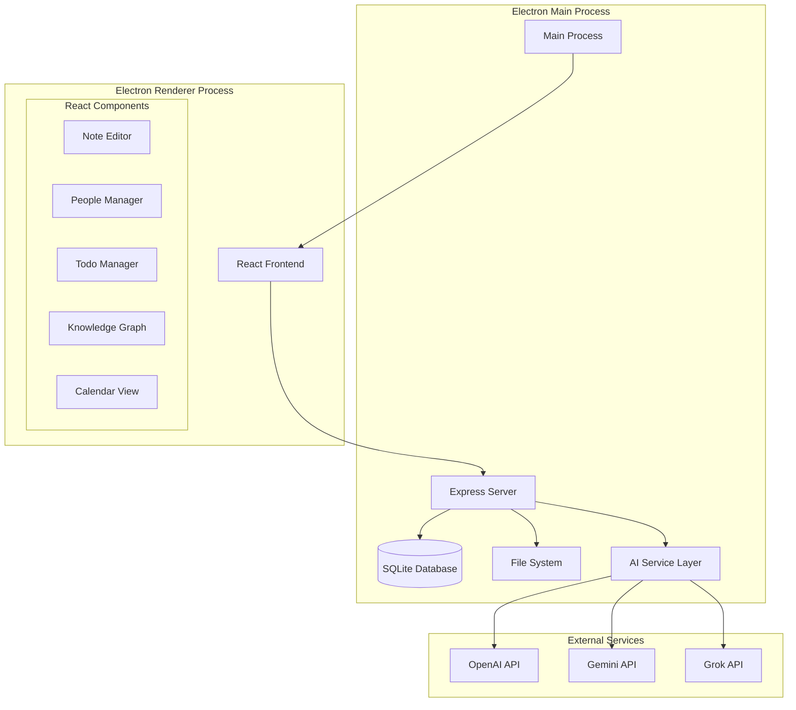

# Design Document

## Overview

NoteSage Desktop is an Electron-based application that packages the existing React/Express stack into a native desktop experience. The application provides a comprehensive knowledge management solution with rich text editing, people management, AI-powered insights, knowledge graph visualization, and todo management.

The design follows a hybrid architecture where an Express server runs embedded within the Electron main process, serving the React frontend through a renderer process. This approach maintains the existing web-based codebase while providing native desktop capabilities and local data storage.

## Architecture

### High-Level Architecture



### Process Architecture

**Main Process Responsibilities:**
- Application lifecycle management
- Express server hosting
- Database operations (SQLite)
- File system operations
- Native OS integration
- Security and sandboxing

**Renderer Process Responsibilities:**
- React UI rendering
- User interaction handling
- API communication with embedded Express server
- Client-side state management

### Communication Patterns

**Frontend ↔ Backend Communication:**
- HTTP/REST API calls from React to embedded Express server
- Standard web patterns (fetch/axios)
- JSON data exchange

**Main ↔ Renderer IPC:**
- File operations (open, save, export)
- Native dialogs (file picker, alerts)
- Application menu actions
- Window management

## Components and Interfaces

### Core Components

#### 1. Note Management System

**Rich Text Editor Component:**
- Block-based editor architecture (similar to Notion)
- Real-time auto-save functionality
- Support for multiple content types:
  - Text blocks (paragraphs, headings, lists)
  - Media blocks (images, files)
  - Code blocks with syntax highlighting
  - Tables with editing capabilities
  - Mermaid diagrams
  - Callout blocks (info, warning, tip)

**Note Organization:**
- Hierarchical folder structure
- Category system (Note, Meeting, custom)
- Tag system with nested hierarchies
- Favorites/bookmarks
- Archive functionality

**Search and Discovery:**
- Global full-text search
- Advanced search with filters
- Quick switcher (fuzzy search)
- Recent notes access

#### 2. People Management System

**Person Profile Component:**
- Contact information fields
- Avatar display
- Connected notes visualization
- Relationship tracking

**People Directory:**
- List/grid view of all contacts
- Search and filtering capabilities
- Bulk operations support

#### 3. Todo Management System

**Todo List Component:**
- Dedicated todos view
- Status tracking (pending/completed)
- Note linkage display
- Person assignment

**Todo Views:**
- Filtered views based on page criteria
- Calendar integration
- Person-specific todo lists

#### 4. Knowledge Graph Visualization

**Graph Component:**
- D3.js-based interactive visualization
- Node types: Notes, People
- Edge types: Mentions, References
- Interactive features:
  - Drag and drop repositioning
  - Zoom and pan
  - Node selection and details
  - Search filtering

#### 5. Calendar View

**Calendar Component:**
The calendar view serves as a unified timeline interface that aggregates all time-based content from across the knowledge base.

**View Types:**
- **Monthly View**: Overview of all time-based content for the month
- **Weekly View**: Detailed week view with time slots
- **Daily View**: Hour-by-hour breakdown of scheduled content
- **Agenda View**: Linear list of upcoming time-based items

**Content Types Displayed:**

*Todos with Due Dates:*
- Display todos with assigned due dates
- Visual indicators for overdue, due today, and upcoming todos
- Color coding by priority or person assignment
- Quick completion toggle directly from calendar

*Notes with Dates:*
- Meeting notes with scheduled times
- Dated journal entries
- Notes with embedded date references
- Notes created on specific dates (with option to show/hide)

*Time-based Content:*
- Events extracted from note content
- Recurring items (weekly meetings, regular check-ins)
- Deadlines mentioned in notes
- Follow-up dates from people interactions

**Calendar Features:**

*Navigation:*
- Month/week/day navigation controls
- Today button for quick return
- Date picker for jumping to specific dates
- Keyboard shortcuts (arrow keys, j/k navigation)

*Content Interaction:*
- Click to view full note/todo details
- Hover previews for quick content viewing
- Drag and drop to reschedule items
- Right-click context menu for quick actions

*Filtering and Views:*
- Filter by content type (todos only, notes only, etc.)
- Filter by person (show items assigned to specific people)
- Filter by category (meeting notes, personal todos, etc.)
- Hide/show completed todos
- Custom date ranges

*Visual Design:*
- Color coding by content type and priority
- Density controls (compact/comfortable/spacious)
- Dark/light theme support
- Print-friendly view option

**Calendar Data Integration:**

*Date Detection:*
- Automatic parsing of dates from note content
- Support for natural language dates ("next Friday", "in 2 weeks")
- Multiple date formats (ISO, US, European)
- Time zone handling for scheduled content

*Smart Scheduling:*
- Suggest optimal times for todos based on existing schedule
- Conflict detection for overlapping items
- Buffer time recommendations between meetings

*Sync and Export:*
- Export calendar data to ICS format
- Integration hooks for external calendar systems
- Backup calendar data with other application data

### Interface Specifications

#### API Endpoints

**Notes API:**
```
GET    /api/notes              - List all notes
POST   /api/notes              - Create new note
GET    /api/notes/:id          - Get specific note
PUT    /api/notes/:id          - Update note
DELETE /api/notes/:id          - Delete note (move to trash)
GET    /api/notes/search       - Search notes
GET    /api/notes/recent       - Get recent notes
```

**People API:**
```
GET    /api/people             - List all people
POST   /api/people             - Create new person
GET    /api/people/:id         - Get specific person
PUT    /api/people/:id         - Update person
DELETE /api/people/:id         - Delete person
GET    /api/people/:id/notes   - Get notes connected to person
```

**Todos API:**
```
GET    /api/todos              - List all todos
POST   /api/todos              - Create new todo
PUT    /api/todos/:id          - Update todo status
DELETE /api/todos/:id          - Delete todo
GET    /api/todos/calendar     - Get todos for calendar view
```

**Calendar API:**
```
GET    /api/calendar           - Get all calendar items for date range
GET    /api/calendar/month     - Get calendar items for specific month
GET    /api/calendar/week      - Get calendar items for specific week
GET    /api/calendar/day       - Get calendar items for specific day
GET    /api/calendar/agenda    - Get upcoming calendar items
POST   /api/calendar/export    - Export calendar data to ICS format
```

**Graph API:**
```
GET    /api/graph              - Get graph data (nodes and edges)
GET    /api/graph/search       - Search graph nodes
```

#### Database Schema

**Notes Table:**
```sql
CREATE TABLE notes (
    id INTEGER PRIMARY KEY,
    title TEXT NOT NULL,
    content TEXT,
    category TEXT DEFAULT 'Note',
    tags TEXT, -- JSON array
    folder_path TEXT,
    scheduled_date DATETIME, -- For meeting notes, scheduled content
    is_archived BOOLEAN DEFAULT FALSE,
    is_pinned BOOLEAN DEFAULT FALSE,
    is_favorite BOOLEAN DEFAULT FALSE,
    created_at DATETIME DEFAULT CURRENT_TIMESTAMP,
    updated_at DATETIME DEFAULT CURRENT_TIMESTAMP
);
```

**People Table:**
```sql
CREATE TABLE people (
    id INTEGER PRIMARY KEY,
    name TEXT NOT NULL,
    email TEXT,
    phone TEXT,
    company TEXT,
    title TEXT,
    linkedin_url TEXT,
    avatar_url TEXT,
    notes TEXT,
    created_at DATETIME DEFAULT CURRENT_TIMESTAMP,
    updated_at DATETIME DEFAULT CURRENT_TIMESTAMP
);
```

**Todos Table:**
```sql
CREATE TABLE todos (
    id INTEGER PRIMARY KEY,
    content TEXT NOT NULL,
    is_completed BOOLEAN DEFAULT FALSE,
    due_date DATE,
    note_id INTEGER,
    person_id INTEGER,
    created_at DATETIME DEFAULT CURRENT_TIMESTAMP,
    completed_at DATETIME,
    FOREIGN KEY (note_id) REFERENCES notes(id),
    FOREIGN KEY (person_id) REFERENCES people(id)
);
```

**Connections Table:**
```sql
CREATE TABLE connections (
    id INTEGER PRIMARY KEY,
    source_type TEXT NOT NULL, -- 'note' or 'person'
    source_id INTEGER NOT NULL,
    target_type TEXT NOT NULL, -- 'note' or 'person'
    target_id INTEGER NOT NULL,
    connection_type TEXT DEFAULT 'mention',
    created_at DATETIME DEFAULT CURRENT_TIMESTAMP
);
```

## Data Models

### Note Model
```typescript
interface Note {
    id: number;
    title: string;
    content: string; // Rich text JSON or Markdown
    category: string;
    tags: string[];
    folderPath: string;
    scheduledDate?: Date; // For meeting notes, scheduled content
    isArchived: boolean;
    isPinned: boolean;
    isFavorite: boolean;
    createdAt: Date;
    updatedAt: Date;
    connections: Connection[];
    todos: Todo[];
    extractedDates?: Date[]; // Dates found in content
}
```

### Person Model
```typescript
interface Person {
    id: number;
    name: string;
    email?: string;
    phone?: string;
    company?: string;
    title?: string;
    linkedinUrl?: string;
    avatarUrl?: string;
    notes?: string;
    createdAt: Date;
    updatedAt: Date;
    connectedNotes: Note[];
    assignedTodos: Todo[];
}
```

### Todo Model
```typescript
interface Todo {
    id: number;
    content: string;
    isCompleted: boolean;
    dueDate?: Date;
    noteId: number;
    personId?: number;
    createdAt: Date;
    completedAt?: Date;
    linkedNote: Note;
    assignedPerson?: Person;
}
```

### Connection Model
```typescript
interface Connection {
    id: number;
    sourceType: 'note' | 'person';
    sourceId: number;
    targetType: 'note' | 'person';
    targetId: number;
    connectionType: 'mention' | 'reference' | 'link';
    createdAt: Date;
}
```

### Calendar Item Model
```typescript
interface CalendarItem {
    id: string; // Composite ID: type-sourceId
    type: 'todo' | 'note' | 'meeting' | 'event';
    title: string;
    date: Date;
    endDate?: Date; // For events with duration
    isAllDay: boolean;
    isCompleted?: boolean; // For todos
    priority?: 'low' | 'medium' | 'high';
    sourceId: number; // ID of the source note/todo
    sourceType: 'note' | 'todo';
    assignedPerson?: Person;
    category?: string;
    color?: string; // For visual categorization
    description?: string;
    location?: string; // For meeting notes
}
```

### Calendar View State Model
```typescript
interface CalendarViewState {
    currentView: 'month' | 'week' | 'day' | 'agenda';
    currentDate: Date;
    selectedDate?: Date;
    filters: {
        showTodos: boolean;
        showNotes: boolean;
        showMeetings: boolean;
        showCompleted: boolean;
        personFilter?: number;
        categoryFilter?: string;
    };
    dateRange: {
        start: Date;
        end: Date;
    };
}
```

## Error Handling

### Application-Level Error Handling

**Database Errors:**
- Connection failures: Graceful degradation with user notification
- Migration errors: Rollback mechanism with user guidance
- Corruption detection: Backup restoration options

**File System Errors:**
- Permission issues: Clear error messages with resolution steps
- Disk space: Proactive monitoring and user warnings
- Path validation: Sanitization and validation

**Network Errors (AI Services):**
- API failures: Graceful degradation, offline mode
- Rate limiting: Queue management and user feedback
- Authentication errors: Clear re-authentication flow

### User Experience Error Handling

**Data Loss Prevention:**
- Auto-save functionality
- Version history maintenance
- Backup and restore capabilities

**Validation Errors:**
- Real-time form validation
- Clear error messages
- Guided correction suggestions

**Recovery Mechanisms:**
- Undo/redo functionality
- Trash/restore for deleted items
- Data export capabilities

## Testing Strategy

### Unit Testing

**Backend Testing:**
- API endpoint testing with Jest/Supertest
- Database operation testing
- AI service integration testing
- File system operation testing

**Frontend Testing:**
- React component testing with React Testing Library
- State management testing
- User interaction testing
- Rich text editor testing

### Integration Testing

**Electron Integration:**
- Main/renderer process communication
- IPC message handling
- Native API integration
- File system operations

**End-to-End Testing:**
- Complete user workflows
- Cross-platform compatibility
- Performance testing
- Data persistence testing

### Platform Testing

**Cross-Platform Compatibility:**
- Windows (10, 11)
- macOS (10.15+)
- Linux (Ubuntu, Fedora, Arch)

**Performance Testing:**
- Large dataset handling
- Memory usage optimization
- Startup time optimization
- Search performance

### Security Testing

**Data Security:**
- Local data encryption
- API key storage security
- Input sanitization
- XSS prevention

**Application Security:**
- Context isolation verification
- Node.js integration security
- File system access controls
- Network request validation

## Deployment and Distribution

### Build Process

**Development Build:**
- Hot reloading for both frontend and backend
- Source maps for debugging
- Development database seeding

**Production Build:**
- Code minification and optimization
- Asset bundling and compression
- Database migration packaging
- Security hardening

### Distribution Strategy

**Platform-Specific Installers:**
- Windows: NSIS installer (.exe)
- macOS: DMG with app bundle
- Linux: AppImage, deb, rpm packages

**Auto-Update Mechanism:**
- Electron-updater integration
- Incremental updates
- Rollback capabilities
- User notification system

### Installation Flow

**First Launch Setup:**
1. Data directory selection
2. Database initialization
3. Migration execution
4. Default configuration setup
5. Optional AI provider configuration

**Update Process:**
1. Background update checking
2. User notification
3. Download and verification
4. Installation with restart
5. Migration execution if needed