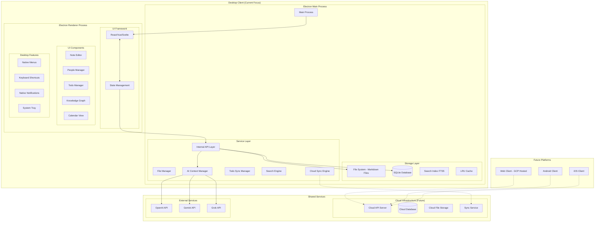

# Design Document

## Overview

NoteSage is a multi-platform knowledge management solution designed with a desktop-first approach that will eventually expand to web (GCP-hosted), Android, and iOS clients. The current focus is on building a robust desktop application with offline-first capabilities, which will serve as the foundation for future platform expansions.

The application uses a hybrid architecture where notes are stored as markdown files (Obsidian-like approach) while metadata and relationships are managed through SQLite for optimal performance and data portability. This architecture is designed to support both local storage (desktop offline) and cloud synchronization (web/mobile) while maintaining the desktop's offline-first advantage.

The design prioritizes:
- **Desktop-native performance** with offline-first functionality as the core offering
- **Multi-platform architecture** that separates business logic from UI implementations
- **Data portability** through markdown files and standardized APIs
- **Scalable design** that can support cloud hosting and mobile clients
- **Synchronization capabilities** between local and cloud storage

## Architecture

### Multi-Platform Architecture

The application uses a layered architecture designed to support multiple platforms while maintaining desktop-first offline capabilities:



### Multi-Platform Strategy

**Phase 1: Desktop-First (Current Focus)**
- Build robust offline-first desktop application
- Establish core architecture and data models
- Perfect user experience and performance
- Create foundation for future platform expansion

**Phase 2: Cloud Infrastructure (Future)**
- Deploy cloud API server on GCP
- Implement cloud database and file storage
- Build synchronization service between desktop and cloud
- Maintain desktop offline capabilities as key differentiator

**Phase 3: Web & Mobile Clients (Future)**
- Web client using same UI components (React/Vue/Svelte)
- Android and iOS native clients
- Shared business logic through standardized APIs
- Feature parity across platforms where possible

### Cloud-First Storage Strategy

**Primary Storage: Cloud Database**
- **PostgreSQL/Cloud SQL**: Primary data storage for all platforms
- **Structured data**: Notes, todos, people, relationships stored as database records
- **Rich content**: Note content stored as structured JSON/HTML for rich editing
- **Real-time sync**: Immediate synchronization across all connected devices
- **Scalable search**: Full-text search with database indexes
- **ACID transactions**: Data consistency and integrity guaranteed

**Desktop Offline Cache: SQLite Mirror**
- **Local SQLite cache**: Complete mirror of user's cloud data
- **Offline-first UX**: All operations work offline with local cache
- **Background sync**: Automatic synchronization when online
- **Conflict resolution**: Simple last-write-wins with user override option
- **Selective sync**: Option to cache only recent/important data

**Cross-Platform Consistency:**
- **Same data model**: Identical database schema across all platforms
- **Unified APIs**: RESTful APIs work consistently for all clients
- **Real-time updates**: WebSocket connections for live collaboration
- **Optimistic updates**: UI updates immediately, syncs in background

**Data Export/Portability:**
- **Export functionality**: Export to markdown, JSON, or other formats
- **Backup options**: Regular automated backups of user data
- **Import capabilities**: Import from other note-taking applications
- **Data ownership**: Users can export their complete dataset anytime

### Database Schema Structure

**Cloud Database (PostgreSQL):**
```sql
-- Notes table with rich content
CREATE TABLE notes (
    id UUID PRIMARY KEY DEFAULT gen_random_uuid(),
    user_id UUID NOT NULL,
    title TEXT NOT NULL,
    content JSONB NOT NULL, -- Rich content as structured JSON
    category TEXT DEFAULT 'Note',
    tags TEXT[] DEFAULT '{}',
    folder_path TEXT DEFAULT '/',
    scheduled_date TIMESTAMPTZ,
    is_archived BOOLEAN DEFAULT FALSE,
    is_pinned BOOLEAN DEFAULT FALSE,
    is_favorite BOOLEAN DEFAULT FALSE,
    created_at TIMESTAMPTZ DEFAULT NOW(),
    updated_at TIMESTAMPTZ DEFAULT NOW(),
    version INTEGER DEFAULT 1
);

-- Todos with unique IDs
CREATE TABLE todos (
    id UUID PRIMARY KEY DEFAULT gen_random_uuid(),
    note_id UUID NOT NULL REFERENCES notes(id) ON DELETE CASCADE,
    todo_id TEXT NOT NULL, -- e.g., "t1", "t2"
    text TEXT NOT NULL,
    is_completed BOOLEAN DEFAULT FALSE,
    assigned_person_id UUID REFERENCES people(id),
    due_date DATE,
    created_at TIMESTAMPTZ DEFAULT NOW(),
    updated_at TIMESTAMPTZ DEFAULT NOW(),
    UNIQUE(note_id, todo_id)
);

-- People management
CREATE TABLE people (
    id UUID PRIMARY KEY DEFAULT gen_random_uuid(),
    user_id UUID NOT NULL,
    name TEXT NOT NULL,
    email TEXT,
    phone TEXT,
    company TEXT,
    title TEXT,
    linkedin_url TEXT,
    avatar_url TEXT,
    notes TEXT,
    created_at TIMESTAMPTZ DEFAULT NOW(),
    updated_at TIMESTAMPTZ DEFAULT NOW()
);
```

**Desktop Cache (SQLite):**
```sql
-- Identical schema to cloud database for consistency
-- Additional sync metadata
CREATE TABLE sync_metadata (
    table_name TEXT PRIMARY KEY,
    last_sync DATETIME DEFAULT CURRENT_TIMESTAMP,
    sync_token TEXT
);

CREATE TABLE offline_queue (
    id INTEGER PRIMARY KEY,
    operation TEXT NOT NULL, -- 'create', 'update', 'delete'
    table_name TEXT NOT NULL,
    record_id TEXT NOT NULL,
    data TEXT, -- JSON
    created_at DATETIME DEFAULT CURRENT_TIMESTAMP
);
```

### Note Content Structure

**Rich Content JSON Format:**
```json
{
  "type": "doc",
  "content": [
    {
      "type": "heading",
      "attrs": { "level": 1 },
      "content": [{ "type": "text", "text": "Team Standup - January 15, 2024" }]
    },
    {
      "type": "paragraph",
      "content": [
        { "type": "text", "text": "Attendees: " },
        { "type": "mention", "attrs": { "type": "person", "id": "john-smith" } },
        { "type": "text", "text": ", " },
        { "type": "mention", "attrs": { "type": "person", "id": "sarah-johnson" } }
      ]
    },
    {
      "type": "todo",
      "attrs": { "todoId": "t1", "completed": true, "assignedTo": "john-smith", "dueDate": "2024-01-14" },
      "content": [{ "type": "text", "text": "Complete API documentation" }]
    },
    {
      "type": "mermaid",
      "attrs": { "code": "graph LR\n    A[Requirements] --> B[Design]" }
    }
  ]
}
```

## Components and Interfaces

### Core Components

#### 1. Cloud Sync Manager

**Cloud Sync Service:**
```typescript
class CloudSyncManager {
    private cloudAPI: CloudAPI;
    private localCache: SQLiteCache;
    private offlineQueue: OfflineQueue;
    private isOnline: boolean = true;
    
    constructor() {
        this.cloudAPI = new CloudAPI();
        this.localCache = new SQLiteCache();
        this.offlineQueue = new OfflineQueue();
        this.setupConnectionMonitoring();
    }
    
    async createNote(note: CreateNoteRequest): Promise<Note> {
        // Always update local cache first (optimistic update)
        const localNote = await this.localCache.createNote(note);
        
        if (this.isOnline) {
            try {
                // Sync to cloud immediately
                const cloudNote = await this.cloudAPI.createNote(note);
                await this.localCache.updateNote(cloudNote.id, cloudNote);
                return cloudNote;
            } catch (error) {
                // Queue for later sync if cloud fails
                await this.offlineQueue.enqueue('create', 'notes', localNote);
                return localNote;
            }
        } else {
            // Queue for sync when online
            await this.offlineQueue.enqueue('create', 'notes', localNote);
            return localNote;
        }
    }
    
    async updateNote(noteId: string, updates: UpdateNoteRequest): Promise<Note> {
        // Update local cache immediately
        const localNote = await this.localCache.updateNote(noteId, updates);
        
        if (this.isOnline) {
            try {
                const cloudNote = await this.cloudAPI.updateNote(noteId, updates);
                await this.localCache.updateNote(noteId, cloudNote);
                return cloudNote;
            } catch (error) {
                await this.offlineQueue.enqueue('update', 'notes', localNote);
                return localNote;
            }
        } else {
            await this.offlineQueue.enqueue('update', 'notes', localNote);
            return localNote;
        }
    }
    
    async syncPendingChanges(): Promise<SyncResult> {
        if (!this.isOnline) return { success: false, reason: 'offline' };
        
        const pendingOperations = await this.offlineQueue.getAllPending();
        const results: SyncResult = { synced: 0, failed: 0, conflicts: 0 };
        
        for (const operation of pendingOperations) {
            try {
                await this.syncOperation(operation);
                await this.offlineQueue.markCompleted(operation.id);
                results.synced++;
            } catch (error) {
                if (this.isConflictError(error)) {
                    await this.handleConflict(operation, error);
                    results.conflicts++;
                } else {
                    results.failed++;
                }
            }
        }
        
        return results;
    }
    
    private async handleConflict(operation: OfflineOperation, error: ConflictError): Promise<void> {
        // Simple conflict resolution: show user both versions
        const resolution = await this.showConflictResolution(operation, error);
        
        switch (resolution.strategy) {
            case 'keep_local':
                await this.cloudAPI.forceUpdate(operation.recordId, operation.data);
                break;
            case 'keep_remote':
                await this.localCache.updateFromCloud(operation.recordId, error.remoteData);
                break;
            case 'merge':
                const merged = await this.mergeData(operation.data, error.remoteData);
                await this.cloudAPI.updateNote(operation.recordId, merged);
                await this.localCache.updateNote(operation.recordId, merged);
                break;
        }
    }
}
```

#### 2. Todo Management System

**Database-First Todo Manager:**
```typescript
class TodoManager {
    private cloudSync: CloudSyncManager;
    private localCache: SQLiteCache;
    
    async createTodo(noteId: string, text: string, assignedPersonId?: string, dueDate?: Date): Promise<Todo> {
        // Generate next todo ID for the note
        const todoId = await this.generateNextTodoId(noteId);
        
        const todo: CreateTodoRequest = {
            noteId,
            todoId,
            text,
            isCompleted: false,
            assignedPersonId,
            dueDate
        };
        
        // Create through cloud sync (handles offline/online automatically)
        const createdTodo = await this.cloudSync.createTodo(todo);
        
        // Update note content to include the todo
        await this.updateNoteWithTodo(noteId, createdTodo);
        
        return createdTodo;
    }
    
    async updateTodoStatus(todoId: string, isCompleted: boolean): Promise<Todo> {
        // Update todo in database
        const updatedTodo = await this.cloudSync.updateTodo(todoId, { isCompleted });
        
        // Update note content to reflect the change
        await this.updateNoteWithTodo(updatedTodo.noteId, updatedTodo);
        
        return updatedTodo;
    }
    
    async getTodosForNote(noteId: string): Promise<Todo[]> {
        // Get from local cache first (fast)
        return await this.localCache.getTodosByNoteId(noteId);
    }
    
    async getAllTodos(filters?: TodoFilters): Promise<Todo[]> {
        let query = this.localCache.query('todos');
        
        if (filters?.isCompleted !== undefined) {
            query = query.where('is_completed', filters.isCompleted);
        }
        
        if (filters?.assignedPersonId) {
            query = query.where('assigned_person_id', filters.assignedPersonId);
        }
        
        if (filters?.dueDateRange) {
            query = query.whereBetween('due_date', [
                filters.dueDateRange.start,
                filters.dueDateRange.end
            ]);
        }
        
        return await query.orderBy('created_at', 'desc');
    }
    
    async syncTodos(): Promise<SyncResult> {
        // Manual sync trigger - sync all pending todo changes
        return await this.cloudSync.syncPendingChanges('todos');
    }
    
    private async generateNextTodoId(noteId: string): Promise<string> {
        const existingTodos = await this.getTodosForNote(noteId);
        const existingIds = existingTodos
            .map(t => parseInt(t.todoId.substring(1))) // Remove 't' prefix
            .filter(id => !isNaN(id));
        
        const nextId = Math.max(0, ...existingIds) + 1;
        return `t${nextId}`;
    }
    
    private async updateNoteWithTodo(noteId: string, todo: Todo): Promise<void> {
        // Update the note's content to reflect todo changes
        const note = await this.localCache.getNote(noteId);
        const updatedContent = this.updateTodoInNoteContent(note.content, todo);
        
        await this.cloudSync.updateNote(noteId, { content: updatedContent });
    }
    
    private updateTodoInNoteContent(content: any, todo: Todo): any {
        // Find and update the todo in the structured content
        return this.traverseContent(content, (node) => {
            if (node.type === 'todo' && node.attrs?.todoId === todo.todoId) {
                return {
                    ...node,
                    attrs: {
                        ...node.attrs,
                        completed: todo.isCompleted,
                        assignedTo: todo.assignedPersonId,
                        dueDate: todo.dueDate
                    }
                };
            }
            return node;
        });
    }
    
    private traverseContent(content: any, transformer: (node: any) => any): any {
        if (Array.isArray(content)) {
            return content.map(item => this.traverseContent(item, transformer));
        }
        
        if (content && typeof content === 'object') {
            const transformed = transformer(content);
            
            if (transformed.content) {
                transformed.content = this.traverseContent(transformed.content, transformer);
            }
            
            return transformed;
        }
        
        return content;
    }
}
```

#### 3. Rich Text Editor Component

**Editor with Slash Commands and Auto-completion:**
```typescript
class RichTextEditor {
    private editor: Editor;
    private slashCommands: SlashCommand[];
    private autoCompleteProviders: AutoCompleteProvider[];
    
    constructor() {
        this.initializeSlashCommands();
        this.initializeAutoComplete();
    }
    
    private initializeSlashCommands(): void {
        this.slashCommands = [
            {
                trigger: '/table',
                description: 'Insert table',
                action: () => this.insertTable()
            },
            {
                trigger: '/code',
                description: 'Insert code block',
                action: () => this.insertCodeBlock()
            },
            {
                trigger: '/callout',
                description: 'Insert callout block',
                action: () => this.insertCallout()
            },
            {
                trigger: '/mermaid',
                description: 'Insert mermaid diagram',
                action: () => this.insertMermaidDiagram()
            },
            {
                trigger: '/todo',
                description: 'Insert todo item',
                action: () => this.insertTodo()
            },
            {
                trigger: '/template',
                description: 'Insert template',
                action: () => this.showTemplateSelector()
            }
        ];
    }
    
    private initializeAutoComplete(): void {
        this.autoCompleteProviders = [
            new PersonMentionProvider(), // @mentions
            new NoteReferenceProvider(), // #references
            new TagProvider(), // #tags
            new DateProvider() // Smart date completion
        ];
    }
    
    async insertTodo(): Promise<void> {
        const nextId = await this.todoManager.generateNextTodoId(this.currentFilePath);
        const todoTemplate = `- [ ][${nextId}] `;
        
        this.editor.insertText(todoTemplate);
        this.editor.focus();
    }
    
    private handleSlashCommand(command: string): void {
        const matchedCommand = this.slashCommands.find(cmd => 
            cmd.trigger.toLowerCase().startsWith(command.toLowerCase())
        );
        
        if (matchedCommand) {
            matchedCommand.action();
        }
    }
}
```

#### 4. Search Engine

**Full-text Search with File and Database Integration:**
```typescript
class SearchEngine {
    private database: Database;
    private fileManager: FileManager;
    
    async globalSearch(query: string, filters?: SearchFilters): Promise<SearchResult[]> {
        const results: SearchResult[] = [];
        
        // Search in database FTS index
        const dbResults = await this.searchDatabase(query, filters);
        
        // Search in file content (for real-time accuracy)
        const fileResults = await this.searchFiles(query, filters);
        
        // Merge and deduplicate results
        return this.mergeSearchResults(dbResults, fileResults);
    }
    
    private async searchDatabase(query: string, filters?: SearchFilters): Promise<SearchResult[]> {
        let sql = `
            SELECT n.file_path, n.title, n.category, n.tags,
                   snippet(notes_fts, 1, '<mark>', '</mark>', '...', 32) as snippet,
                   rank
            FROM notes_fts 
            JOIN note_metadata n ON notes_fts.rowid = n.id
            WHERE notes_fts MATCH ?
        `;
        
        const params = [query];
        
        if (filters?.category) {
            sql += ` AND n.category = ?`;
            params.push(filters.category);
        }
        
        if (filters?.tags?.length) {
            sql += ` AND (${filters.tags.map(() => 'n.tags LIKE ?').join(' OR ')})`;
            params.push(...filters.tags.map(tag => `%${tag}%`));
        }
        
        if (filters?.dateRange) {
            sql += ` AND n.modified BETWEEN ? AND ?`;
            params.push(filters.dateRange.start.toISOString(), filters.dateRange.end.toISOString());
        }
        
        sql += ` ORDER BY rank LIMIT 50`;
        
        const rows = await this.database.all(sql, params);
        
        return rows.map(row => ({
            filePath: row.file_path,
            title: row.title,
            category: row.category,
            tags: JSON.parse(row.tags || '[]'),
            snippet: row.snippet,
            score: row.rank
        }));
    }
    
    async quickSwitcher(query: string): Promise<QuickSwitchResult[]> {
        // Fuzzy search for note titles and file names
        const allNotes = await this.getAllNoteMetadata();
        
        return fuzzySearch(allNotes, query, {
            keys: ['title', 'fileName'],
            threshold: 0.6
        }).slice(0, 10);
    }
    
    async recentNotes(limit: number = 10): Promise<NoteMetadata[]> {
        return await this.database.all(`
            SELECT * FROM note_metadata 
            ORDER BY last_accessed DESC, modified DESC 
            LIMIT ?
        `, [limit]);
    }
}
```

#### 5. Knowledge Graph Component

**Graph Visualization with D3.js:**
```typescript
class KnowledgeGraph {
    private svg: d3.Selection<SVGSVGElement, unknown, null, undefined>;
    private simulation: d3.Simulation<GraphNode, GraphLink>;
    private nodes: GraphNode[];
    private links: GraphLink[];
    
    constructor(container: HTMLElement) {
        this.initializeVisualization(container);
        this.setupSimulation();
    }
    
    async loadGraphData(): Promise<void> {
        const graphData = await this.fetchGraphData();
        this.nodes = graphData.nodes;
        this.links = graphData.links;
        
        this.updateVisualization();
    }
    
    private async fetchGraphData(): Promise<GraphData> {
        // Fetch nodes (notes and people)
        const notes = await this.api.get('/api/notes');
        const people = await this.api.get('/api/people');
        const connections = await this.api.get('/api/connections');
        
        const nodes: GraphNode[] = [
            ...notes.map(note => ({
                id: `note-${note.id}`,
                type: 'note',
                title: note.title,
                category: note.category,
                size: Math.log(note.content.length + 1) * 3
            })),
            ...people.map(person => ({
                id: `person-${person.id}`,
                type: 'person',
                title: person.name,
                size: 8
            }))
        ];
        
        const links: GraphLink[] = connections.map(conn => ({
            source: `${conn.source_type}-${conn.source_id}`,
            target: `${conn.target_type}-${conn.target_id}`,
            type: conn.connection_type
        }));
        
        return { nodes, links };
    }
    
    private updateVisualization(): void {
        // Update nodes
        const nodeSelection = this.svg.selectAll('.node')
            .data(this.nodes, d => d.id);
        
        const nodeEnter = nodeSelection.enter()
            .append('g')
            .attr('class', 'node')
            .call(this.drag());
        
        nodeEnter.append('circle')
            .attr('r', d => d.size)
            .attr('fill', d => this.getNodeColor(d.type));
        
        nodeEnter.append('text')
            .attr('dy', '.35em')
            .attr('text-anchor', 'middle')
            .text(d => d.title);
        
        // Update links
        const linkSelection = this.svg.selectAll('.link')
            .data(this.links);
        
        linkSelection.enter()
            .append('line')
            .attr('class', 'link')
            .attr('stroke', '#999')
            .attr('stroke-opacity', 0.6);
        
        // Restart simulation
        this.simulation.nodes(this.nodes);
        this.simulation.force('link').links(this.links);
        this.simulation.restart();
    }
}
```

## Data Models

### Note Metadata Model
```typescript
interface NoteMetadata {
    id: number;
    filePath: string;
    title: string;
    category: string;
    tags: string[];
    created: Date;
    modified: Date;
    scheduled?: Date;
    size: number;
    wordCount: number;
    isArchived: boolean;
    isPinned: boolean;
    isFavorite: boolean;
    lastAccessed: Date;
    lastScanned: Date; // For todo sync
}
```

### Todo Model
```typescript
interface Todo {
    id: string; // Composite: filePath:todoId
    todoId: string; // e.g., "t1", "t2"
    filePath: string;
    text: string;
    isCompleted: boolean;
    assignedPerson?: string;
    dueDate?: Date;
    createdAt: Date;
    updatedAt: Date;
    rawText: string; // Original markdown text
}
```

### Person Model
```typescript
interface Person {
    id: number;
    name: string;
    email?: string;
    phone?: string;
    company?: string;
    title?: string;
    linkedinUrl?: string;
    avatarUrl?: string;
    notes?: string;
    createdAt: Date;
    updatedAt: Date;
}
```

## Database Schema

### Note Metadata Table
```sql
CREATE TABLE note_metadata (
    id INTEGER PRIMARY KEY,
    file_path TEXT UNIQUE NOT NULL,
    title TEXT NOT NULL,
    category TEXT DEFAULT 'Note',
    tags TEXT, -- JSON array
    created DATETIME NOT NULL,
    modified DATETIME NOT NULL,
    scheduled DATETIME,
    size INTEGER DEFAULT 0,
    word_count INTEGER DEFAULT 0,
    is_archived BOOLEAN DEFAULT FALSE,
    is_pinned BOOLEAN DEFAULT FALSE,
    is_favorite BOOLEAN DEFAULT FALSE,
    last_accessed DATETIME DEFAULT CURRENT_TIMESTAMP,
    last_scanned DATETIME DEFAULT CURRENT_TIMESTAMP
);

-- Full-Text Search Index
CREATE VIRTUAL TABLE notes_fts USING fts5(
    title, content, tags,
    content='',
    tokenize='porter'
);
```

### Todo References Table
```sql
CREATE TABLE todo_references (
    id TEXT PRIMARY KEY, -- Composite: filePath:todoId
    todo_id TEXT NOT NULL, -- e.g., "t1", "t2"
    file_path TEXT NOT NULL,
    text TEXT NOT NULL,
    is_completed BOOLEAN DEFAULT FALSE,
    assigned_person TEXT,
    due_date DATE,
    created_at DATETIME DEFAULT CURRENT_TIMESTAMP,
    updated_at DATETIME DEFAULT CURRENT_TIMESTAMP,
    FOREIGN KEY (file_path) REFERENCES note_metadata(file_path) ON DELETE CASCADE
);

CREATE INDEX idx_todo_file_path ON todo_references(file_path);
CREATE INDEX idx_todo_completed ON todo_references(is_completed);
CREATE INDEX idx_todo_due_date ON todo_references(due_date);
```

### People Table
```sql
CREATE TABLE people (
    id INTEGER PRIMARY KEY,
    name TEXT NOT NULL,
    email TEXT,
    phone TEXT,
    company TEXT,
    title TEXT,
    linkedin_url TEXT,
    avatar_url TEXT,
    notes TEXT,
    created_at DATETIME DEFAULT CURRENT_TIMESTAMP,
    updated_at DATETIME DEFAULT CURRENT_TIMESTAMP
);
```

### Connections Table
```sql
CREATE TABLE connections (
    id INTEGER PRIMARY KEY,
    source_type TEXT NOT NULL, -- 'note' or 'person'
    source_id TEXT NOT NULL, -- file_path for notes, id for people
    target_type TEXT NOT NULL,
    target_id TEXT NOT NULL,
    connection_type TEXT DEFAULT 'mention',
    created_at DATETIME DEFAULT CURRENT_TIMESTAMP
);

CREATE INDEX idx_connections_source ON connections(source_type, source_id);
CREATE INDEX idx_connections_target ON connections(target_type, target_id);
```

## Error Handling

### File System Error Handling
- **File not found**: Graceful degradation with user notification
- **Permission errors**: Clear error messages with suggested solutions
- **Disk space**: Monitor available space and warn users
- **Corruption**: Automatic backup restoration options

### Database Error Handling
- **Connection failures**: Retry logic with exponential backoff
- **Schema migrations**: Safe migration with rollback capability
- **Constraint violations**: User-friendly error messages
- **Performance issues**: Query optimization and monitoring

### Sync Error Handling
- **Todo sync conflicts**: Manual resolution interface
- **File modification conflicts**: Three-way merge options
- **Network failures**: Offline queue with retry logic

## Testing Strategy

### Unit Testing
- File management operations
- Todo parsing and sync logic
- Search functionality
- Database operations
- AI integration components

### Integration Testing
- End-to-end note creation and editing
- Todo synchronization across file and database
- Search accuracy and performance
- Graph visualization data flow

### Performance Testing
- Large file handling (>10MB notes)
- Database query performance with 10k+ notes
- Search response times
- Memory usage monitoring

### User Acceptance Testing
- Note-taking workflows
- Todo management scenarios
- Search and discovery tasks
- Knowledge graph navigation