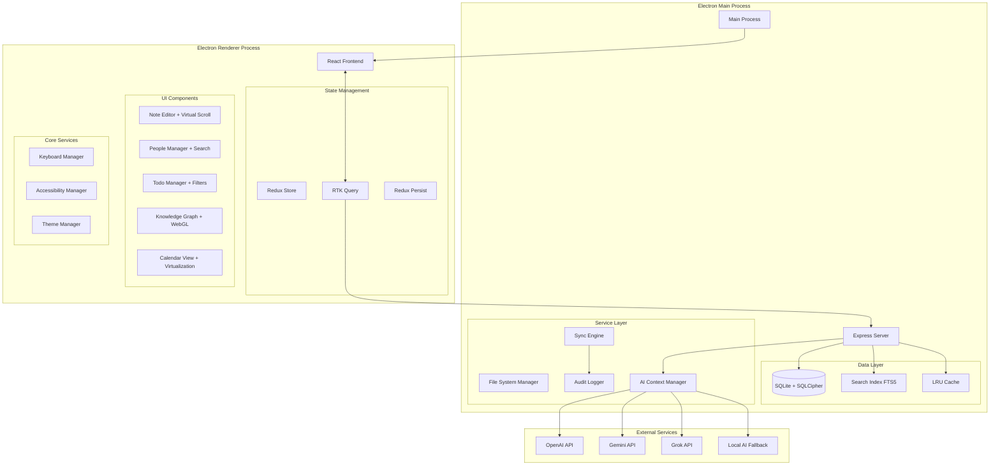

# Design Document

## Overview

NoteSage Desktop is an Electron-based application that packages the existing React/Express stack into a native desktop experience. The application provides a comprehensive knowledge management solution with rich text editing, people management, AI-powered insights, knowledge graph visualization, and todo management.

The design follows a hybrid architecture where an Express server runs embedded within the Electron main process, serving the React frontend through a renderer process. This approach maintains the existing web-based codebase while providing native desktop capabilities and local data storage.

## Architecture

### High-Level Architecture



### Performance-First Architecture Principles

**Data Access Optimization:**
- Implement connection pooling for SQLite
- Use prepared statements for all queries
- Implement query result caching with TTL
- Add database query performance monitoring

**Memory Management:**
- Implement virtual scrolling for all large lists
- Use React.memo and useMemo strategically
- Implement image lazy loading and compression
- Add memory usage monitoring and cleanup

**Startup Performance:**
- Lazy load non-critical components
- Implement code splitting by feature
- Preload critical data during splash screen
- Use service workers for background tasks

### Process Architecture

**Main Process Responsibilities:**
- Application lifecycle management
- Express server hosting
- Database operations (SQLite)
- File system operations
- Native OS integration
- Security and sandboxing

**Renderer Process Responsibilities:**
- React UI rendering
- User interaction handling
- API communication with embedded Express server
- Client-side state management

### Communication Patterns

**Frontend ↔ Backend Communication:**
- HTTP/REST API calls from React to embedded Express server
- Standard web patterns (fetch/axios)
- JSON data exchange

**Main ↔ Renderer IPC:**
- File operations (open, save, export)
- Native dialogs (file picker, alerts)
- Application menu actions
- Window management

## Components and Interfaces

### Core Components

#### 1. Note Management System

**Rich Text Editor Component:**
- Block-based editor architecture (similar to Notion)
- Real-time auto-save functionality with 2-second debounce
- Slash commands ("/") system for quick content insertion:
  - `/table` - Insert table
  - `/code` - Insert code block
  - `/callout` - Insert callout block
  - `/image` - Insert image
  - `/mermaid` - Insert mermaid diagram
- Block-level operations:
  - Drag and drop to reorder blocks
  - Duplicate blocks with Cmd+D
  - Delete blocks with backspace/delete
  - Block selection and bulk operations
- Auto-completion and smart suggestions:
  - @mention autocomplete for people
  - #reference autocomplete for notes
  - Tag suggestions based on existing tags
  - Smart text completion based on note history
- Dual editing modes:
  - Rich text WYSIWYG mode (default)
  - Raw markdown editing mode toggle
- Support for multiple content types:
  - Text blocks (paragraphs, headings, lists)
  - Media blocks (images, files)
  - Code blocks with syntax highlighting
  - Tables with editing capabilities
  - Mermaid diagrams
  - Callout blocks (info, warning, tip)

**Note Organization:**
- Hierarchical folder structure
- Category system (Note, Meeting, custom)
- Nested hierarchical tag system:
  - Support for tag hierarchies (e.g., `work/projects/client-a`)
  - Tag autocomplete with hierarchy visualization
  - Bulk tag operations
- Favorites/bookmarks system
- Archive functionality
- Custom sorting options:
  - By date (created/modified)
  - By title (alphabetical)
  - By category
  - By tag
  - By word count
  - Custom user-defined sorting

**Note Templates System:**
- Template creation from existing notes
- Template categories (meeting, project, daily, etc.)
- Template variables and placeholders
- Quick template application via slash commands
- Template sharing and import/export

**Version History System:**
- Automatic version snapshots on significant changes
- Version comparison with diff visualization
- Restore to previous version capability
- Version metadata (timestamp, change summary)
- Configurable retention policy

**Search and Discovery:**
- Global full-text search
- Advanced search with filters
- Quick switcher (fuzzy search)
- Recent notes access

#### 2. People Management System

**Person Profile Component:**
- Contact information fields
- Avatar display
- Connected notes visualization
- Relationship tracking

**People Directory:**
- List/grid view of all contacts
- Search and filtering capabilities
- Bulk operations support

#### 3. Todo Management System

**Todo List Component:**
- Dedicated todos view
- Status tracking (pending/completed)
- Note linkage display (required for manual todos)
- Person assignment
- Cross-reference update system:
  - When todo marked complete, update all note references
  - Maintain todo status consistency across all mentions
  - Real-time sync of todo states

**Todo Views:**
- Advanced filtering system:
  - Filter by note/page criteria
  - Pending-only filter option
  - Filter by assigned person
  - Filter by due date range
  - Custom search-based filters
- Calendar integration with due dates
- Person-specific todo lists
- Bulk todo operations (mark complete, assign, delete)

**Manual Todo Creation:**
- Mandatory note linkage for manually created todos
- Note selection interface during todo creation
- Validation to prevent orphaned todos
- Auto-suggestion of relevant notes based on context

#### 4. Knowledge Graph Visualization

**Graph Component:**
- D3.js-based interactive visualization with force-directed layout
- Node types: Notes, People
- Edge types: Mentions, References, Connections
- Interactive features:
  - Drag and drop repositioning with physics simulation
  - Zoom and pan with smooth transitions
  - Node selection with detailed preview panels
  - Search filtering with node highlighting
  - Cluster visualization for related content
  - Customizable node colors and sizes
  - Export graph as image or data
- Performance optimizations:
  - Canvas rendering for large graphs (>1000 nodes)
  - Level-of-detail rendering
  - Viewport culling for off-screen nodes

#### 5. Calendar View

**Calendar Component:**
The calendar view serves as a unified timeline interface that aggregates all time-based content from across the knowledge base.

**View Types:**
- **Monthly View**: Overview of all time-based content for the month
- **Weekly View**: Detailed week view with time slots
- **Daily View**: Hour-by-hour breakdown of scheduled content
- **Agenda View**: Linear list of upcoming time-based items

**Content Types Displayed:**

*Todos with Due Dates:*
- Display todos with assigned due dates
- Visual indicators for overdue, due today, and upcoming todos
- Color coding by priority or person assignment
- Quick completion toggle directly from calendar

*Notes with Dates:*
- Meeting notes with scheduled times
- Dated journal entries
- Notes with embedded date references
- Notes created on specific dates (with option to show/hide)

*Time-based Content:*
- Events extracted from note content
- Recurring items (weekly meetings, regular check-ins)
- Deadlines mentioned in notes
- Follow-up dates from people interactions

**Calendar Features:**

*Navigation:*
- Month/week/day navigation controls
- Today button for quick return
- Date picker for jumping to specific dates
- Keyboard shortcuts (arrow keys, j/k navigation)

*Content Interaction:*
- Click to view full note/todo details
- Hover previews for quick content viewing
- Drag and drop to reschedule items
- Right-click context menu for quick actions

*Filtering and Views:*
- Filter by content type (todos only, notes only, etc.)
- Filter by person (show items assigned to specific people)
- Filter by category (meeting notes, personal todos, etc.)
- Hide/show completed todos
- Custom date ranges

*Visual Design:*
- Color coding by content type and priority
- Density controls (compact/comfortable/spacious)
- Dark/light theme support
- Print-friendly view option

**Calendar Data Integration:**

*Date Detection:*
- Automatic parsing of dates from note content
- Support for natural language dates ("next Friday", "in 2 weeks")
- Multiple date formats (ISO, US, European)
- Time zone handling for scheduled content

*Smart Scheduling:*
- Suggest optimal times for todos based on existing schedule
- Conflict detection for overlapping items
- Buffer time recommendations between meetings

*Sync and Export:*
- Export calendar data to ICS format
- Integration hooks for external calendar systems
- Backup calendar data with other application data

### Interface Specifications

#### API Endpoints

**Notes API:**
```
GET    /api/notes              - List all notes
POST   /api/notes              - Create new note
GET    /api/notes/:id          - Get specific note
PUT    /api/notes/:id          - Update note
DELETE /api/notes/:id          - Delete note (move to trash)
GET    /api/notes/search       - Search notes
GET    /api/notes/recent       - Get recent notes
```

**People API:**
```
GET    /api/people             - List all people
POST   /api/people             - Create new person
GET    /api/people/:id         - Get specific person
PUT    /api/people/:id         - Update person
DELETE /api/people/:id         - Delete person
GET    /api/people/:id/notes   - Get notes connected to person
```

**Todos API:**
```
GET    /api/todos              - List all todos
POST   /api/todos              - Create new todo
PUT    /api/todos/:id          - Update todo status
DELETE /api/todos/:id          - Delete todo
GET    /api/todos/calendar     - Get todos for calendar view
```

**Calendar API:**
```
GET    /api/calendar           - Get all calendar items for date range
GET    /api/calendar/month     - Get calendar items for specific month
GET    /api/calendar/week      - Get calendar items for specific week
GET    /api/calendar/day       - Get calendar items for specific day
GET    /api/calendar/agenda    - Get upcoming calendar items
POST   /api/calendar/export    - Export calendar data to ICS format
```

**Graph API:**
```
GET    /api/graph              - Get graph data (nodes and edges)
GET    /api/graph/search       - Search graph nodes
```

#### Database Schema

**Notes Table:**
```sql
CREATE TABLE notes (
    id INTEGER PRIMARY KEY,
    title TEXT NOT NULL,
    content TEXT,
    content_hash TEXT NOT NULL, -- For change detection
    category TEXT DEFAULT 'Note',
    tags TEXT, -- JSON array
    folder_path TEXT,
    scheduled_date DATETIME,
    word_count INTEGER DEFAULT 0,
    is_archived BOOLEAN DEFAULT FALSE,
    is_pinned BOOLEAN DEFAULT FALSE,
    is_favorite BOOLEAN DEFAULT FALSE,
    version INTEGER DEFAULT 1,
    created_at DATETIME DEFAULT CURRENT_TIMESTAMP,
    updated_at DATETIME DEFAULT CURRENT_TIMESTAMP,
    created_by TEXT DEFAULT 'user',
    updated_by TEXT DEFAULT 'user',
    auto_save_enabled BOOLEAN DEFAULT TRUE,
    last_auto_save DATETIME
);

-- Version History Table
CREATE TABLE note_versions (
    id INTEGER PRIMARY KEY,
    note_id INTEGER NOT NULL,
    version_number INTEGER NOT NULL,
    title TEXT NOT NULL,
    content TEXT,
    content_hash TEXT NOT NULL,
    change_summary TEXT,
    created_at DATETIME DEFAULT CURRENT_TIMESTAMP,
    created_by TEXT DEFAULT 'user',
    FOREIGN KEY (note_id) REFERENCES notes(id) ON DELETE CASCADE,
    UNIQUE(note_id, version_number)
);

-- Note Templates Table
CREATE TABLE note_templates (
    id INTEGER PRIMARY KEY,
    name TEXT NOT NULL,
    description TEXT,
    category TEXT,
    template_content TEXT NOT NULL,
    variables TEXT, -- JSON array of template variables
    created_at DATETIME DEFAULT CURRENT_TIMESTAMP,
    updated_at DATETIME DEFAULT CURRENT_TIMESTAMP
);

-- Performance Indexes
CREATE INDEX idx_notes_updated_at ON notes(updated_at DESC);
CREATE INDEX idx_notes_category ON notes(category);
CREATE INDEX idx_notes_folder_path ON notes(folder_path);
CREATE INDEX idx_notes_scheduled_date ON notes(scheduled_date);
CREATE INDEX idx_notes_content_hash ON notes(content_hash);

-- Full-Text Search
CREATE VIRTUAL TABLE notes_fts USING fts5(
    title, content, tags,
    content='notes',
    content_rowid='id'
);

-- Triggers for FTS sync
CREATE TRIGGER notes_fts_insert AFTER INSERT ON notes BEGIN
    INSERT INTO notes_fts(rowid, title, content, tags) 
    VALUES (new.id, new.title, new.content, new.tags);
END;

CREATE TRIGGER notes_fts_update AFTER UPDATE ON notes BEGIN
    UPDATE notes_fts SET title=new.title, content=new.content, tags=new.tags 
    WHERE rowid=new.id;
END;

CREATE TRIGGER notes_fts_delete AFTER DELETE ON notes BEGIN
    DELETE FROM notes_fts WHERE rowid=old.id;
END;
```

**People Table:**
```sql
CREATE TABLE people (
    id INTEGER PRIMARY KEY,
    name TEXT NOT NULL,
    email TEXT,
    phone TEXT,
    company TEXT,
    title TEXT,
    linkedin_url TEXT,
    avatar_url TEXT,
    notes TEXT,
    created_at DATETIME DEFAULT CURRENT_TIMESTAMP,
    updated_at DATETIME DEFAULT CURRENT_TIMESTAMP
);
```

**Todos Table:**
```sql
CREATE TABLE todos (
    id INTEGER PRIMARY KEY,
    content TEXT NOT NULL,
    is_completed BOOLEAN DEFAULT FALSE,
    due_date DATE,
    note_id INTEGER,
    person_id INTEGER,
    created_at DATETIME DEFAULT CURRENT_TIMESTAMP,
    completed_at DATETIME,
    FOREIGN KEY (note_id) REFERENCES notes(id),
    FOREIGN KEY (person_id) REFERENCES people(id)
);
```

**Connections Table:**
```sql
CREATE TABLE connections (
    id INTEGER PRIMARY KEY,
    source_type TEXT NOT NULL, -- 'note' or 'person'
    source_id INTEGER NOT NULL,
    target_type TEXT NOT NULL, -- 'note' or 'person'
    target_id INTEGER NOT NULL,
    connection_type TEXT DEFAULT 'mention',
    created_at DATETIME DEFAULT CURRENT_TIMESTAMP
);
```

## Data Models

### Note Model
```typescript
interface Note {
    id: number;
    title: string;
    content: string; // Rich text JSON or Markdown
    category: string;
    tags: string[];
    folderPath: string;
    scheduledDate?: Date; // For meeting notes, scheduled content
    isArchived: boolean;
    isPinned: boolean;
    isFavorite: boolean;
    createdAt: Date;
    updatedAt: Date;
    connections: Connection[];
    todos: Todo[];
    extractedDates?: Date[]; // Dates found in content
}
```

### Person Model
```typescript
interface Person {
    id: number;
    name: string;
    email?: string;
    phone?: string;
    company?: string;
    title?: string;
    linkedinUrl?: string;
    avatarUrl?: string;
    notes?: string;
    createdAt: Date;
    updatedAt: Date;
    connectedNotes: Note[];
    assignedTodos: Todo[];
}
```

### Todo Model
```typescript
interface Todo {
    id: number;
    content: string;
    isCompleted: boolean;
    dueDate?: Date;
    noteId: number;
    personId?: number;
    createdAt: Date;
    completedAt?: Date;
    linkedNote: Note;
    assignedPerson?: Person;
}
```

### Connection Model
```typescript
interface Connection {
    id: number;
    sourceType: 'note' | 'person';
    sourceId: number;
    targetType: 'note' | 'person';
    targetId: number;
    connectionType: 'mention' | 'reference' | 'link';
    createdAt: Date;
}
```

### Calendar Item Model
```typescript
interface CalendarItem {
    id: string; // Composite ID: type-sourceId
    type: 'todo' | 'note' | 'meeting' | 'event';
    title: string;
    date: Date;
    endDate?: Date; // For events with duration
    isAllDay: boolean;
    isCompleted?: boolean; // For todos
    priority?: 'low' | 'medium' | 'high';
    sourceId: number; // ID of the source note/todo
    sourceType: 'note' | 'todo';
    assignedPerson?: Person;
    category?: string;
    color?: string; // For visual categorization
    description?: string;
    location?: string; // For meeting notes
}
```

### Calendar View State Model
```typescript
interface CalendarViewState {
    currentView: 'month' | 'week' | 'day' | 'agenda';
    currentDate: Date;
    selectedDate?: Date;
    filters: {
        showTodos: boolean;
        showNotes: boolean;
        showMeetings: boolean;
        showCompleted: boolean;
        personFilter?: number;
        categoryFilter?: string;
    };
    dateRange: {
        start: Date;
        end: Date;
    };
}
```

## Auto-Save System Implementation

### Real-time Auto-Save Architecture

```typescript
class AutoSaveManager {
    private saveQueue = new Map<number, SaveOperation>();
    private debounceTimer: NodeJS.Timeout | null = null;
    private readonly SAVE_DELAY = 2000; // 2 seconds
    private readonly MAX_QUEUE_SIZE = 100;
    
    async scheduleAutoSave(noteId: number, content: string, title: string): Promise<void> {
        // Cancel previous timer
        if (this.debounceTimer) {
            clearTimeout(this.debounceTimer);
        }
        
        // Add to save queue
        this.saveQueue.set(noteId, {
            noteId,
            content,
            title,
            timestamp: Date.now(),
            contentHash: this.calculateHash(content)
        });
        
        // Limit queue size
        if (this.saveQueue.size > this.MAX_QUEUE_SIZE) {
            await this.flushOldestSaves();
        }
        
        // Schedule debounced save
        this.debounceTimer = setTimeout(() => {
            this.executePendingSaves();
        }, this.SAVE_DELAY);
    }
    
    private async executePendingSaves(): Promise<void> {
        const saves = Array.from(this.saveQueue.values());
        this.saveQueue.clear();
        
        // Group saves by note to handle rapid edits
        const groupedSaves = this.groupSavesByNote(saves);
        
        // Execute saves in parallel
        const savePromises = groupedSaves.map(save => this.executeSave(save));
        await Promise.allSettled(savePromises);
    }
    
    private async executeSave(save: SaveOperation): Promise<void> {
        try {
            // Check if content actually changed
            const currentHash = await this.getCurrentContentHash(save.noteId);
            if (currentHash === save.contentHash) {
                return; // No changes to save
            }
            
            // Save to SQLite database
            await this.database.updateNote(save.noteId, {
                title: save.title,
                content: save.content,
                content_hash: save.contentHash,
                updated_at: new Date(),
                last_auto_save: new Date()
            });
            
            // Create version snapshot if significant change
            if (this.isSignificantChange(save)) {
                await this.createVersionSnapshot(save);
            }
            
            // Emit save success event
            this.eventEmitter.emit('note:auto-saved', save.noteId);
            
        } catch (error) {
            // Handle save failure gracefully
            this.logger.error('Auto-save failed', { noteId: save.noteId, error });
            this.eventEmitter.emit('note:save-failed', save.noteId, error);
            
            // Retry with exponential backoff
            await this.scheduleRetry(save);
        }
    }
    
    private isSignificantChange(save: SaveOperation): boolean {
        // Create version snapshot for significant changes
        const wordCountDiff = this.calculateWordCountDiff(save);
        const timeSinceLastVersion = this.getTimeSinceLastVersion(save.noteId);
        
        return wordCountDiff > 50 || timeSinceLastVersion > 3600000; // 1 hour
    }
}

interface SaveOperation {
    noteId: number;
    content: string;
    title: string;
    timestamp: number;
    contentHash: string;
}
```

## Error Handling & Resilience

### Comprehensive Error Management Strategy

**Database Resilience:**
```typescript
interface DatabaseError {
    code: string;
    message: string;
    severity: 'low' | 'medium' | 'high' | 'critical';
    recovery: 'retry' | 'rollback' | 'restore' | 'manual';
    userAction?: string;
}

class DatabaseManager {
    private retryPolicy = new ExponentialBackoff();
    private healthCheck = new HealthMonitor();
    
    async executeQuery(query: string, params: any[]): Promise<any> {
        return this.retryPolicy.execute(async () => {
            try {
                return await this.db.prepare(query).all(params);
            } catch (error) {
                await this.handleDatabaseError(error);
                throw error;
            }
        });
    }
    
    private async handleDatabaseError(error: any): Promise<void> {
        // Log error with context
        await this.auditLogger.logError(error);
        
        // Check database integrity
        if (error.code === 'SQLITE_CORRUPT') {
            await this.initiateRecovery();
        }
        
        // Update health status
        this.healthCheck.recordFailure(error);
    }
}
```

**AI Service Resilience:**
```typescript
class AIServiceManager {
    private circuitBreaker = new CircuitBreaker();
    private contextManager = new AIContextManager();
    private fallbackService = new LocalAIFallback();
    private keyManager = new SecureKeyManager();
    
    async processRequest(request: AIRequest): Promise<AIResponse> {
        // Check if AI is configured
        if (!this.isAIConfigured()) {
            return this.handleNoAIConfiguration(request);
        }
        
        // Check circuit breaker
        if (this.circuitBreaker.isOpen()) {
            return this.fallbackService.process(request);
        }
        
        try {
            const response = await this.primaryService.process(request);
            this.circuitBreaker.recordSuccess();
            return response;
        } catch (error) {
            this.circuitBreaker.recordFailure();
            
            // Graceful degradation
            return this.handleAIFailure(request, error);
        }
    }
    
    private handleNoAIConfiguration(request: AIRequest): AIResponse {
        // Ensure all manual features work without AI
        switch (request.type) {
            case 'todo_extraction':
                return { todos: [], message: 'AI not configured - manual todo creation available' };
            case 'insights':
                return { insights: [], message: 'AI not configured - manual analysis available' };
            default:
                return { success: true, message: 'Feature available in manual mode' };
        }
    }
    
    private handleAIFailure(request: AIRequest, error: Error): AIResponse {
        // Intelligent fallback based on request type
        if (request.type === 'todo_extraction') {
            return this.fallbackService.extractTodos(request.content);
        }
        
        // Log error but don't break core functionality
        this.logger.warn('AI service unavailable, falling back to manual mode', error);
        return { success: false, fallback: true, message: 'AI temporarily unavailable' };
    }
}

class SecureKeyManager {
    private keychain = require('keytar');
    
    async storeAPIKey(provider: 'openai' | 'gemini' | 'grok', key: string): Promise<void> {
        await this.keychain.setPassword('notesage-ai', provider, key);
    }
    
    async getAPIKey(provider: string): Promise<string | null> {
        return await this.keychain.getPassword('notesage-ai', provider);
    }
    
    async deleteAPIKey(provider: string): Promise<void> {
        await this.keychain.deletePassword('notesage-ai', provider);
    }
}
```

**User Experience Error Recovery:**
- **Optimistic UI Updates**: Show changes immediately, rollback on failure
- **Conflict Resolution**: Detect and resolve concurrent edit conflicts
- **Data Recovery**: Multiple backup strategies with point-in-time recovery
- **Graceful Degradation**: Core functionality works even when advanced features fail

### User Experience Error Handling

**Data Loss Prevention:**
- Auto-save functionality
- Version history maintenance
- Backup and restore capabilities

**Validation Errors:**
- Real-time form validation
- Clear error messages
- Guided correction suggestions

**Recovery Mechanisms:**
- Undo/redo functionality
- Trash/restore for deleted items
- Data export capabilities

## Security Architecture

### Data Protection Strategy

**Encryption at Rest:**
```typescript
class SecureDataManager {
    private cipher: SQLCipher;
    private keyManager: KeychainManager;
    
    async initializeDatabase(userPassword: string): Promise<void> {
        const dbKey = await this.keyManager.deriveKey(userPassword);
        this.cipher = new SQLCipher(dbKey);
        
        // Enable encryption
        await this.cipher.pragma('cipher_page_size = 4096');
        await this.cipher.pragma('kdf_iter = 256000');
    }
    
    async encryptSensitiveData(data: any): Promise<string> {
        const key = await this.keyManager.getEncryptionKey();
        return AES.encrypt(JSON.stringify(data), key).toString();
    }
}
```

**Input Sanitization & Validation:**
```typescript
class SecurityValidator {
    static sanitizeContent(content: string): string {
        return DOMPurify.sanitize(content, {
            ALLOWED_TAGS: ['p', 'br', 'strong', 'em', 'ul', 'ol', 'li', 'h1', 'h2', 'h3'],
            ALLOWED_ATTR: ['class', 'id'],
            FORBID_SCRIPT: true
        });
    }
    
    static validateApiInput(input: any, schema: JSONSchema): ValidationResult {
        const validator = new Ajv({ allErrors: true });
        const validate = validator.compile(schema);
        
        if (!validate(input)) {
            throw new ValidationError(validate.errors);
        }
        
        return { valid: true, sanitized: this.sanitizeObject(input) };
    }
}
```

**Audit Logging:**
```typescript
interface AuditEvent {
    timestamp: Date;
    userId: string;
    action: string;
    resource: string;
    resourceId: string;
    metadata: Record<string, any>;
    ipAddress?: string;
    userAgent?: string;
}

class AuditLogger {
    async logEvent(event: AuditEvent): Promise<void> {
        const encryptedEvent = await this.encrypt(event);
        await this.db.run(`
            INSERT INTO audit_log (timestamp, event_data, hash)
            VALUES (?, ?, ?)
        `, [event.timestamp, encryptedEvent, this.calculateHash(event)]);
    }
}
```

## Performance Optimization

### Virtual Scrolling Implementation
```typescript
class VirtualizedNoteList extends React.Component {
    private observer: IntersectionObserver;
    private cache = new Map<number, NoteItem>();
    
    componentDidMount() {
        this.observer = new IntersectionObserver(
            this.handleIntersection,
            { rootMargin: '100px' }
        );
    }
    
    private handleIntersection = (entries: IntersectionObserverEntry[]) => {
        entries.forEach(entry => {
            if (entry.isIntersecting) {
                this.loadNoteData(entry.target.dataset.noteId);
            }
        });
    };
    
    render() {
        return (
            <FixedSizeList
                height={600}
                itemCount={this.props.noteCount}
                itemSize={80}
                itemData={this.props.notes}
                overscanCount={5}
            >
                {this.renderNoteItem}
            </FixedSizeList>
        );
    }
}
```

### Search Performance Optimization
```typescript
class SearchManager {
    private searchIndex: FlexSearch.Index;
    private debouncer = new Debouncer(300);
    
    constructor() {
        this.searchIndex = new FlexSearch.Index({
            preset: 'performance',
            tokenize: 'forward',
            resolution: 9,
            depth: 4
        });
    }
    
    async search(query: string): Promise<SearchResult[]> {
        return this.debouncer.execute(async () => {
            // Use FTS5 for complex queries
            if (this.isComplexQuery(query)) {
                return this.fullTextSearch(query);
            }
            
            // Use in-memory index for simple queries
            const results = await this.searchIndex.search(query, { limit: 50 });
            return this.hydrateResults(results);
        });
    }
}
```

## Accessibility & User Experience

### Keyboard Navigation System
```typescript
class KeyboardManager {
    private shortcuts = new Map<string, KeyboardShortcut>();
    private contextStack: string[] = [];
    
    registerShortcut(context: string, key: string, action: () => void) {
        const shortcut = new KeyboardShortcut(key, action, context);
        this.shortcuts.set(`${context}:${key}`, shortcut);
    }
    
    handleKeyDown = (event: KeyboardEvent) => {
        const currentContext = this.getCurrentContext();
        const shortcutKey = `${currentContext}:${this.getKeyString(event)}`;
        
        const shortcut = this.shortcuts.get(shortcutKey);
        if (shortcut && shortcut.canExecute()) {
            event.preventDefault();
            shortcut.execute();
        }
    };
    
    // Global shortcuts
    private initializeGlobalShortcuts() {
        this.registerShortcut('global', 'cmd+k', () => this.openCommandPalette());
        this.registerShortcut('global', 'cmd+n', () => this.createNewNote());
        this.registerShortcut('global', 'cmd+shift+f', () => this.openGlobalSearch());
        this.registerShortcut('global', 'cmd+/', () => this.showKeyboardHelp());
    }
}
```

### Accessibility Implementation
```typescript
class AccessibilityManager {
    private announcer: LiveAnnouncer;
    private focusManager: FocusManager;
    
    announceChange(message: string, priority: 'polite' | 'assertive' = 'polite') {
        this.announcer.announce(message, priority);
    }
    
    manageFocus(element: HTMLElement, options?: FocusOptions) {
        this.focusManager.setFocus(element, {
            preventScroll: options?.preventScroll ?? false,
            restoreOnUnmount: options?.restoreOnUnmount ?? true
        });
    }
    
    // ARIA live regions for dynamic content
    setupLiveRegions() {
        const statusRegion = document.createElement('div');
        statusRegion.setAttribute('aria-live', 'polite');
        statusRegion.setAttribute('aria-atomic', 'true');
        statusRegion.className = 'sr-only';
        document.body.appendChild(statusRegion);
    }
}
```

## Testing Strategy

### Unit Testing

**Backend Testing:**
- API endpoint testing with Jest/Supertest
- Database operation testing
- AI service integration testing
- File system operation testing

**Frontend Testing:**
- React component testing with React Testing Library
- State management testing
- User interaction testing
- Rich text editor testing

### Integration Testing

**Electron Integration:**
- Main/renderer process communication
- IPC message handling
- Native API integration
- File system operations

**End-to-End Testing:**
- Complete user workflows
- Cross-platform compatibility
- Performance testing
- Data persistence testing

### Platform Testing

**Cross-Platform Compatibility:**
- Windows (10, 11)
- macOS (10.15+)
- Linux (Ubuntu, Fedora, Arch)

**Performance Testing:**
- Large dataset handling
- Memory usage optimization
- Startup time optimization
- Search performance

### Security Testing

**Data Security:**
- Local data encryption
- API key storage security
- Input sanitization
- XSS prevention

**Application Security:**
- Context isolation verification
- Node.js integration security
- File system access controls
- Network request validation

## Deployment and Distribution

### Build Process

**Development Build:**
- Hot reloading for both frontend and backend
- Source maps for debugging
- Development database seeding

**Production Build:**
- Code minification and optimization
- Asset bundling and compression
- Database migration packaging
- Security hardening

### Distribution Strategy

**Platform-Specific Installers:**
- Windows: NSIS installer (.exe)
- macOS: DMG with app bundle
- Linux: AppImage, deb, rpm packages

**Auto-Update Mechanism:**
- Electron-updater integration
- Incremental updates
- Rollback capabilities
- User notification system

### Installation Flow

**First Launch Setup:**
```typescript
class FirstLaunchManager {
    async initializeApplication(): Promise<void> {
        try {
            // Step 1: Data directory selection
            const dataDirectory = await this.selectDataDirectory();
            
            // Step 2: Validate directory permissions
            await this.validateDirectoryAccess(dataDirectory);
            
            // Step 3: Database initialization
            await this.initializeDatabase(dataDirectory);
            
            // Step 4: Run initial migrations
            await this.runDatabaseMigrations();
            
            // Step 5: Default configuration setup
            await this.setupDefaultConfiguration();
            
            // Step 6: Optional AI provider configuration
            await this.showAIConfigurationDialog();
            
        } catch (error) {
            await this.handleSetupError(error);
        }
    }
    
    private async selectDataDirectory(): Promise<string> {
        const { dialog } = require('electron');
        const result = await dialog.showOpenDialog({
            properties: ['openDirectory', 'createDirectory'],
            title: 'Select Data Directory for NoteSage',
            message: 'Choose where to store your notes and data',
            defaultPath: path.join(os.homedir(), 'NoteSage')
        });
        
        if (result.canceled) {
            throw new Error('Data directory selection canceled');
        }
        
        return result.filePaths[0];
    }
    
    private async validateDirectoryAccess(directory: string): Promise<void> {
        try {
            // Test write permissions
            const testFile = path.join(directory, '.write-test');
            await fs.writeFile(testFile, 'test');
            await fs.unlink(testFile);
        } catch (error) {
            throw new Error(`Directory not writable: ${directory}. Please select a different location.`);
        }
    }
    
    private async handleSetupError(error: Error): Promise<void> {
        const { dialog } = require('electron');
        
        const troubleshootingGuide = this.generateTroubleshootingGuide(error);
        
        await dialog.showErrorBox(
            'Setup Failed',
            `${error.message}\n\nTroubleshooting:\n${troubleshootingGuide}`
        );
        
        // Offer to retry or exit
        const choice = await dialog.showMessageBox({
            type: 'error',
            buttons: ['Retry Setup', 'Exit Application'],
            defaultId: 0,
            message: 'Setup failed. Would you like to try again?'
        });
        
        if (choice.response === 0) {
            await this.initializeApplication();
        } else {
            app.quit();
        }
    }
}
```

**Database Relocation System:**
```typescript
class DatabaseManager {
    async relocateDatabase(newPath: string): Promise<void> {
        const currentPath = this.getCurrentDatabasePath();
        
        try {
            // Step 1: Validate new location
            await this.validateDirectoryAccess(newPath);
            
            // Step 2: Close current database connections
            await this.closeAllConnections();
            
            // Step 3: Copy database file safely
            const newDbPath = path.join(newPath, 'notesage.db');
            await fs.copyFile(currentPath, newDbPath);
            
            // Step 4: Verify integrity of copied database
            await this.verifyDatabaseIntegrity(newDbPath);
            
            // Step 5: Update configuration
            await this.updateDatabasePath(newDbPath);
            
            // Step 6: Remove old database file
            await fs.unlink(currentPath);
            
            // Step 7: Reconnect to new database
            await this.initializeDatabase(newDbPath);
            
        } catch (error) {
            // Rollback on failure
            await this.rollbackRelocation(currentPath);
            throw new Error(`Database relocation failed: ${error.message}`);
        }
    }
}
```

**Update Process:**
1. Background update checking with user notification
2. Download and cryptographic verification
3. Installation with automatic restart
4. Database migration execution if needed
5. Configuration migration and validation
6. Rollback capability if update fails