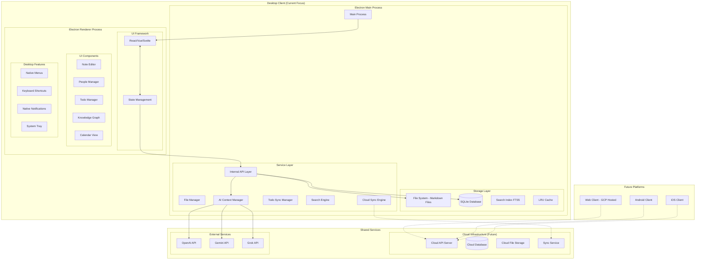
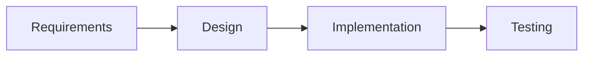

# Design Document

## Overview

NoteSage is a multi-platform knowledge management solution designed with a desktop-first approach that will eventually expand to web (GCP-hosted), Android, and iOS clients. The current focus is on building a robust desktop application with offline-first capabilities, which will serve as the foundation for future platform expansions.

The application uses a hybrid architecture where notes are stored as markdown files (Obsidian-like approach) while metadata and relationships are managed through SQLite for optimal performance and data portability. This architecture is designed to support both local storage (desktop offline) and cloud synchronization (web/mobile) while maintaining the desktop's offline-first advantage.

The design prioritizes:
- **Desktop-native performance** with offline-first functionality as the core offering
- **Multi-platform architecture** that separates business logic from UI implementations
- **Data portability** through markdown files and standardized APIs
- **Scalable design** that can support cloud hosting and mobile clients
- **Synchronization capabilities** between local and cloud storage

## Architecture

### Multi-Platform Architecture

The application uses a layered architecture designed to support multiple platforms while maintaining desktop-first offline capabilities:



### Multi-Platform Strategy

**Phase 1: Desktop-First (Current Focus)**
- Build robust offline-first desktop application
- Establish core architecture and data models
- Perfect user experience and performance
- Create foundation for future platform expansion

**Phase 2: Cloud Infrastructure (Future)**
- Deploy cloud API server on GCP
- Implement cloud database and file storage
- Build synchronization service between desktop and cloud
- Maintain desktop offline capabilities as key differentiator

**Phase 3: Web & Mobile Clients (Future)**
- Web client using same UI components (React/Vue/Svelte)
- Android and iOS native clients
- Shared business logic through standardized APIs
- Feature parity across platforms where possible

### Storage Strategy

**Desktop Storage (Current):**
- **Markdown Files (.md)**: Note content in hierarchical folder structure
- **YAML frontmatter**: Basic metadata (title, category, tags, dates)
- **Embedded todos**: `- [ ][t1] Task text @person date` format
- **Direct file access**: Users can edit with external editors
- **Version control ready**: Git integration possible
- **SQLite Database**: Metadata, relationships, search indexes, AI results

**Future Cloud Storage:**
- **Cloud file storage**: Synchronized markdown files
- **Cloud database**: Shared metadata and relationships
- **Hybrid sync**: Desktop maintains local files + cloud backup
- **Conflict resolution**: Merge strategies for simultaneous edits
- **Offline-first**: Desktop continues working without internet

**Cross-Platform Data Models:**
- **Standardized APIs**: Same data models across all platforms
- **Platform-agnostic business logic**: Core functionality shared
- **Platform-specific optimizations**: UI and storage optimized per platform

### File Structure Example

```
/data-directory/
├── notes/
│   ├── meetings/
│   │   ├── 2024-01-15-team-standup.md
│   │   └── 2024-01-16-client-review.md
│   ├── projects/
│   │   ├── project-alpha/
│   │   │   ├── requirements.md
│   │   │   └── design-notes.md
│   │   └── project-beta.md
│   └── personal/
│       ├── daily-notes/
│       │   ├── 2024-01-15.md
│       │   └── 2024-01-16.md
│       └── ideas.md
├── templates/
│   ├── meeting-template.md
│   ├── project-template.md
│   └── daily-template.md
├── archive/
│   └── old-notes/
└── database.db
```

### Note File Format

```markdown
---
title: "Team Standup - January 15, 2024"
category: "Meeting"
tags: ["team", "standup", "project-alpha"]
created: 2024-01-15T09:00:00Z
modified: 2024-01-15T10:30:00Z
scheduled: 2024-01-15T09:00:00Z
---

# Team Standup - January 15, 2024

## Attendees
- @John Smith
- @Sarah Johnson
- @Mike Davis

## Discussion Points

### Project Alpha Updates
- [x][t1] Complete API documentation @John Smith 2024-01-14
- [ ][t2] Review security requirements @Sarah Johnson 2024-01-16
- [ ][t3] Setup testing environment @Mike Davis 2024-01-17

### Action Items
- [ ][t4] Schedule client demo @John Smith next week
- [ ][t5] Update project timeline #Project Alpha Planning

## Notes
The team discussed progress on #Project Alpha and identified key blockers.
Need to follow up with @Client Representative about requirements.

## Mermaid Diagram

```

## Components and Interfaces

### Core Components

#### 1. File Management System

**File Manager Service:**
```typescript
class FileManager {
    private dataDirectory: string;
    private notesDirectory: string;
    private templatesDirectory: string;
    private archiveDirectory: string;
    
    constructor(dataDirectory: string) {
        this.dataDirectory = dataDirectory;
        this.notesDirectory = path.join(dataDirectory, 'notes');
        this.templatesDirectory = path.join(dataDirectory, 'templates');
        this.archiveDirectory = path.join(dataDirectory, 'archive');
    }
    
    async createNote(folderPath: string, title: string, content: string, metadata: NoteMetadata): Promise<string> {
        const fileName = this.sanitizeFileName(title) + '.md';
        const fullPath = path.join(this.notesDirectory, folderPath, fileName);
        
        // Ensure directory exists
        await fs.ensureDir(path.dirname(fullPath));
        
        // Create markdown content with frontmatter
        const markdownContent = this.createMarkdownWithFrontmatter(content, metadata);
        
        // Write file
        await fs.writeFile(fullPath, markdownContent, 'utf8');
        
        return fullPath;
    }
    
    async readNote(filePath: string): Promise<{ content: string; metadata: NoteMetadata }> {
        const rawContent = await fs.readFile(filePath, 'utf8');
        return this.parseMarkdownWithFrontmatter(rawContent);
    }
    
    async updateNote(filePath: string, content: string, metadata: NoteMetadata): Promise<void> {
        const markdownContent = this.createMarkdownWithFrontmatter(content, metadata);
        await fs.writeFile(filePath, markdownContent, 'utf8');
        
        // Update modification time in database
        await this.updateFileMetadata(filePath, {
            modified: new Date(),
            size: markdownContent.length
        });
    }
    
    async moveNote(oldPath: string, newPath: string): Promise<void> {
        await fs.ensureDir(path.dirname(newPath));
        await fs.move(oldPath, newPath);
        
        // Update database references
        await this.updateFilePathReferences(oldPath, newPath);
    }
    
    async archiveNote(filePath: string): Promise<string> {
        const relativePath = path.relative(this.notesDirectory, filePath);
        const archivePath = path.join(this.archiveDirectory, relativePath);
        
        await fs.ensureDir(path.dirname(archivePath));
        await fs.move(filePath, archivePath);
        
        return archivePath;
    }
    
    private createMarkdownWithFrontmatter(content: string, metadata: NoteMetadata): string {
        const frontmatter = yaml.dump(metadata);
        return `---\n${frontmatter}---\n\n${content}`;
    }
    
    private parseMarkdownWithFrontmatter(rawContent: string): { content: string; metadata: NoteMetadata } {
        const { data: metadata, content } = matter(rawContent);
        return { content, metadata: metadata as NoteMetadata };
    }
}
```

#### 2. Todo Management System

**Todo Sync Manager with ID-based System:**
```typescript
class TodoSyncManager {
    private todoPattern = /- \[([ x])\]\[([t]\d+)\] (.+)/g;
    private database: Database;
    private fileManager: FileManager;
    
    async scanNoteForTodos(filePath: string): Promise<Todo[]> {
        const { content } = await this.fileManager.readNote(filePath);
        const todos: Todo[] = [];
        let match;
        
        // Reset regex lastIndex
        this.todoPattern.lastIndex = 0;
        
        while ((match = this.todoPattern.exec(content)) !== null) {
            const isCompleted = match[1] === 'x';
            const todoId = match[2]; // e.g., "t1", "t2"
            const todoText = match[3];
            
            // Parse @person and date from todo text
            const { text, person, date } = this.parseTodoContent(todoText);
            
            todos.push({
                id: `${filePath}:${todoId}`, // Composite ID
                todoId: todoId,
                filePath: filePath,
                text: text,
                isCompleted: isCompleted,
                assignedPerson: person,
                dueDate: date,
                rawText: match[0]
            });
        }
        
        return todos;
    }
    
    async updateTodoStatus(compositeId: string, isCompleted: boolean): Promise<void> {
        const [filePath, todoId] = compositeId.split(':');
        
        // Read current file content
        const { content, metadata } = await this.fileManager.readNote(filePath);
        
        // Update the specific todo
        const updatedContent = this.updateTodoInContent(content, todoId, isCompleted);
        
        // Write back to file
        await this.fileManager.updateNote(filePath, updatedContent, {
            ...metadata,
            modified: new Date()
        });
        
        // Update database reference
        await this.updateTodoInDatabase(compositeId, isCompleted);
    }
    
    async manualSync(): Promise<SyncResult> {
        const result: SyncResult = {
            scannedFiles: 0,
            updatedTodos: 0,
            newTodos: 0,
            deletedTodos: 0
        };
        
        // Get all notes that have been modified since last scan
        const modifiedNotes = await this.getModifiedNotes();
        
        for (const noteInfo of modifiedNotes) {
            const todos = await this.scanNoteForTodos(noteInfo.filePath);
            
            // Compare with existing todos in database
            const existingTodos = await this.getTodosForNote(noteInfo.filePath);
            
            // Update database with changes
            await this.syncTodosToDatabase(noteInfo.filePath, todos, existingTodos);
            
            // Update last scan timestamp
            await this.updateLastScanTime(noteInfo.filePath);
            
            result.scannedFiles++;
        }
        
        return result;
    }
    
    private updateTodoInContent(content: string, todoId: string, isCompleted: boolean): string {
        const checkbox = isCompleted ? '[x]' : '[ ]';
        const pattern = new RegExp(`- \\[([ x])\\]\\[${todoId}\\]`, 'g');
        
        return content.replace(pattern, `- ${checkbox}[${todoId}]`);
    }
    
    private parseTodoContent(todoText: string): { text: string; person?: string; date?: Date } {
        // Extract @person mentions
        const personMatch = todoText.match(/@([^@\s]+(?:\s+[^@\s]+)*)/);
        const person = personMatch ? personMatch[1] : undefined;
        
        // Extract dates (various formats)
        const dateMatch = todoText.match(/(\d{4}-\d{2}-\d{2}|next week|tomorrow|today)/i);
        const date = dateMatch ? this.parseDate(dateMatch[1]) : undefined;
        
        // Clean text (remove @person and date)
        let cleanText = todoText
            .replace(/@([^@\s]+(?:\s+[^@\s]+)*)/, '')
            .replace(/(\d{4}-\d{2}-\d{2}|next week|tomorrow|today)/i, '')
            .trim();
        
        return { text: cleanText, person, date };
    }
    
    async generateNextTodoId(filePath: string): Promise<string> {
        const existingTodos = await this.getTodosForNote(filePath);
        const existingIds = existingTodos.map(t => parseInt(t.todoId.substring(1))); // Remove 't' prefix
        const nextId = Math.max(0, ...existingIds) + 1;
        return `t${nextId}`;
    }
}
```

#### 3. Rich Text Editor Component

**Editor with Slash Commands and Auto-completion:**
```typescript
class RichTextEditor {
    private editor: Editor;
    private slashCommands: SlashCommand[];
    private autoCompleteProviders: AutoCompleteProvider[];
    
    constructor() {
        this.initializeSlashCommands();
        this.initializeAutoComplete();
    }
    
    private initializeSlashCommands(): void {
        this.slashCommands = [
            {
                trigger: '/table',
                description: 'Insert table',
                action: () => this.insertTable()
            },
            {
                trigger: '/code',
                description: 'Insert code block',
                action: () => this.insertCodeBlock()
            },
            {
                trigger: '/callout',
                description: 'Insert callout block',
                action: () => this.insertCallout()
            },
            {
                trigger: '/mermaid',
                description: 'Insert mermaid diagram',
                action: () => this.insertMermaidDiagram()
            },
            {
                trigger: '/todo',
                description: 'Insert todo item',
                action: () => this.insertTodo()
            },
            {
                trigger: '/template',
                description: 'Insert template',
                action: () => this.showTemplateSelector()
            }
        ];
    }
    
    private initializeAutoComplete(): void {
        this.autoCompleteProviders = [
            new PersonMentionProvider(), // @mentions
            new NoteReferenceProvider(), // #references
            new TagProvider(), // #tags
            new DateProvider() // Smart date completion
        ];
    }
    
    async insertTodo(): Promise<void> {
        const nextId = await this.todoManager.generateNextTodoId(this.currentFilePath);
        const todoTemplate = `- [ ][${nextId}] `;
        
        this.editor.insertText(todoTemplate);
        this.editor.focus();
    }
    
    private handleSlashCommand(command: string): void {
        const matchedCommand = this.slashCommands.find(cmd => 
            cmd.trigger.toLowerCase().startsWith(command.toLowerCase())
        );
        
        if (matchedCommand) {
            matchedCommand.action();
        }
    }
}
```

#### 4. Search Engine

**Full-text Search with File and Database Integration:**
```typescript
class SearchEngine {
    private database: Database;
    private fileManager: FileManager;
    
    async globalSearch(query: string, filters?: SearchFilters): Promise<SearchResult[]> {
        const results: SearchResult[] = [];
        
        // Search in database FTS index
        const dbResults = await this.searchDatabase(query, filters);
        
        // Search in file content (for real-time accuracy)
        const fileResults = await this.searchFiles(query, filters);
        
        // Merge and deduplicate results
        return this.mergeSearchResults(dbResults, fileResults);
    }
    
    private async searchDatabase(query: string, filters?: SearchFilters): Promise<SearchResult[]> {
        let sql = `
            SELECT n.file_path, n.title, n.category, n.tags,
                   snippet(notes_fts, 1, '<mark>', '</mark>', '...', 32) as snippet,
                   rank
            FROM notes_fts 
            JOIN note_metadata n ON notes_fts.rowid = n.id
            WHERE notes_fts MATCH ?
        `;
        
        const params = [query];
        
        if (filters?.category) {
            sql += ` AND n.category = ?`;
            params.push(filters.category);
        }
        
        if (filters?.tags?.length) {
            sql += ` AND (${filters.tags.map(() => 'n.tags LIKE ?').join(' OR ')})`;
            params.push(...filters.tags.map(tag => `%${tag}%`));
        }
        
        if (filters?.dateRange) {
            sql += ` AND n.modified BETWEEN ? AND ?`;
            params.push(filters.dateRange.start.toISOString(), filters.dateRange.end.toISOString());
        }
        
        sql += ` ORDER BY rank LIMIT 50`;
        
        const rows = await this.database.all(sql, params);
        
        return rows.map(row => ({
            filePath: row.file_path,
            title: row.title,
            category: row.category,
            tags: JSON.parse(row.tags || '[]'),
            snippet: row.snippet,
            score: row.rank
        }));
    }
    
    async quickSwitcher(query: string): Promise<QuickSwitchResult[]> {
        // Fuzzy search for note titles and file names
        const allNotes = await this.getAllNoteMetadata();
        
        return fuzzySearch(allNotes, query, {
            keys: ['title', 'fileName'],
            threshold: 0.6
        }).slice(0, 10);
    }
    
    async recentNotes(limit: number = 10): Promise<NoteMetadata[]> {
        return await this.database.all(`
            SELECT * FROM note_metadata 
            ORDER BY last_accessed DESC, modified DESC 
            LIMIT ?
        `, [limit]);
    }
}
```

#### 5. Knowledge Graph Component

**Graph Visualization with D3.js:**
```typescript
class KnowledgeGraph {
    private svg: d3.Selection<SVGSVGElement, unknown, null, undefined>;
    private simulation: d3.Simulation<GraphNode, GraphLink>;
    private nodes: GraphNode[];
    private links: GraphLink[];
    
    constructor(container: HTMLElement) {
        this.initializeVisualization(container);
        this.setupSimulation();
    }
    
    async loadGraphData(): Promise<void> {
        const graphData = await this.fetchGraphData();
        this.nodes = graphData.nodes;
        this.links = graphData.links;
        
        this.updateVisualization();
    }
    
    private async fetchGraphData(): Promise<GraphData> {
        // Fetch nodes (notes and people)
        const notes = await this.api.get('/api/notes');
        const people = await this.api.get('/api/people');
        const connections = await this.api.get('/api/connections');
        
        const nodes: GraphNode[] = [
            ...notes.map(note => ({
                id: `note-${note.id}`,
                type: 'note',
                title: note.title,
                category: note.category,
                size: Math.log(note.content.length + 1) * 3
            })),
            ...people.map(person => ({
                id: `person-${person.id}`,
                type: 'person',
                title: person.name,
                size: 8
            }))
        ];
        
        const links: GraphLink[] = connections.map(conn => ({
            source: `${conn.source_type}-${conn.source_id}`,
            target: `${conn.target_type}-${conn.target_id}`,
            type: conn.connection_type
        }));
        
        return { nodes, links };
    }
    
    private updateVisualization(): void {
        // Update nodes
        const nodeSelection = this.svg.selectAll('.node')
            .data(this.nodes, d => d.id);
        
        const nodeEnter = nodeSelection.enter()
            .append('g')
            .attr('class', 'node')
            .call(this.drag());
        
        nodeEnter.append('circle')
            .attr('r', d => d.size)
            .attr('fill', d => this.getNodeColor(d.type));
        
        nodeEnter.append('text')
            .attr('dy', '.35em')
            .attr('text-anchor', 'middle')
            .text(d => d.title);
        
        // Update links
        const linkSelection = this.svg.selectAll('.link')
            .data(this.links);
        
        linkSelection.enter()
            .append('line')
            .attr('class', 'link')
            .attr('stroke', '#999')
            .attr('stroke-opacity', 0.6);
        
        // Restart simulation
        this.simulation.nodes(this.nodes);
        this.simulation.force('link').links(this.links);
        this.simulation.restart();
    }
}
```

## Data Models

### Note Metadata Model
```typescript
interface NoteMetadata {
    id: number;
    filePath: string;
    title: string;
    category: string;
    tags: string[];
    created: Date;
    modified: Date;
    scheduled?: Date;
    size: number;
    wordCount: number;
    isArchived: boolean;
    isPinned: boolean;
    isFavorite: boolean;
    lastAccessed: Date;
    lastScanned: Date; // For todo sync
}
```

### Todo Model
```typescript
interface Todo {
    id: string; // Composite: filePath:todoId
    todoId: string; // e.g., "t1", "t2"
    filePath: string;
    text: string;
    isCompleted: boolean;
    assignedPerson?: string;
    dueDate?: Date;
    createdAt: Date;
    updatedAt: Date;
    rawText: string; // Original markdown text
}
```

### Person Model
```typescript
interface Person {
    id: number;
    name: string;
    email?: string;
    phone?: string;
    company?: string;
    title?: string;
    linkedinUrl?: string;
    avatarUrl?: string;
    notes?: string;
    createdAt: Date;
    updatedAt: Date;
}
```

## Database Schema

### Note Metadata Table
```sql
CREATE TABLE note_metadata (
    id INTEGER PRIMARY KEY,
    file_path TEXT UNIQUE NOT NULL,
    title TEXT NOT NULL,
    category TEXT DEFAULT 'Note',
    tags TEXT, -- JSON array
    created DATETIME NOT NULL,
    modified DATETIME NOT NULL,
    scheduled DATETIME,
    size INTEGER DEFAULT 0,
    word_count INTEGER DEFAULT 0,
    is_archived BOOLEAN DEFAULT FALSE,
    is_pinned BOOLEAN DEFAULT FALSE,
    is_favorite BOOLEAN DEFAULT FALSE,
    last_accessed DATETIME DEFAULT CURRENT_TIMESTAMP,
    last_scanned DATETIME DEFAULT CURRENT_TIMESTAMP
);

-- Full-Text Search Index
CREATE VIRTUAL TABLE notes_fts USING fts5(
    title, content, tags,
    content='',
    tokenize='porter'
);
```

### Todo References Table
```sql
CREATE TABLE todo_references (
    id TEXT PRIMARY KEY, -- Composite: filePath:todoId
    todo_id TEXT NOT NULL, -- e.g., "t1", "t2"
    file_path TEXT NOT NULL,
    text TEXT NOT NULL,
    is_completed BOOLEAN DEFAULT FALSE,
    assigned_person TEXT,
    due_date DATE,
    created_at DATETIME DEFAULT CURRENT_TIMESTAMP,
    updated_at DATETIME DEFAULT CURRENT_TIMESTAMP,
    FOREIGN KEY (file_path) REFERENCES note_metadata(file_path) ON DELETE CASCADE
);

CREATE INDEX idx_todo_file_path ON todo_references(file_path);
CREATE INDEX idx_todo_completed ON todo_references(is_completed);
CREATE INDEX idx_todo_due_date ON todo_references(due_date);
```

### People Table
```sql
CREATE TABLE people (
    id INTEGER PRIMARY KEY,
    name TEXT NOT NULL,
    email TEXT,
    phone TEXT,
    company TEXT,
    title TEXT,
    linkedin_url TEXT,
    avatar_url TEXT,
    notes TEXT,
    created_at DATETIME DEFAULT CURRENT_TIMESTAMP,
    updated_at DATETIME DEFAULT CURRENT_TIMESTAMP
);
```

### Connections Table
```sql
CREATE TABLE connections (
    id INTEGER PRIMARY KEY,
    source_type TEXT NOT NULL, -- 'note' or 'person'
    source_id TEXT NOT NULL, -- file_path for notes, id for people
    target_type TEXT NOT NULL,
    target_id TEXT NOT NULL,
    connection_type TEXT DEFAULT 'mention',
    created_at DATETIME DEFAULT CURRENT_TIMESTAMP
);

CREATE INDEX idx_connections_source ON connections(source_type, source_id);
CREATE INDEX idx_connections_target ON connections(target_type, target_id);
```

## Error Handling

### File System Error Handling
- **File not found**: Graceful degradation with user notification
- **Permission errors**: Clear error messages with suggested solutions
- **Disk space**: Monitor available space and warn users
- **Corruption**: Automatic backup restoration options

### Database Error Handling
- **Connection failures**: Retry logic with exponential backoff
- **Schema migrations**: Safe migration with rollback capability
- **Constraint violations**: User-friendly error messages
- **Performance issues**: Query optimization and monitoring

### Sync Error Handling
- **Todo sync conflicts**: Manual resolution interface
- **File modification conflicts**: Three-way merge options
- **Network failures**: Offline queue with retry logic

## Testing Strategy

### Unit Testing
- File management operations
- Todo parsing and sync logic
- Search functionality
- Database operations
- AI integration components

### Integration Testing
- End-to-end note creation and editing
- Todo synchronization across file and database
- Search accuracy and performance
- Graph visualization data flow

### Performance Testing
- Large file handling (>10MB notes)
- Database query performance with 10k+ notes
- Search response times
- Memory usage monitoring

### User Acceptance Testing
- Note-taking workflows
- Todo management scenarios
- Search and discovery tasks
- Knowledge graph navigation