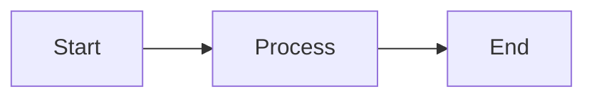

# Creating and Managing Notes

Notes are the core of your NoteSage knowledge base. This guide covers everything you need to know about creating, editing, and organizing your notes.

## Creating Notes

### New Note
- Click **"New Note"** button
- Press `Ctrl+N` (Windows/Linux) or `Cmd+N` (Mac)
- Use slash command `/new` in any note

### From Templates
1. Click **"New Note"** dropdown
2. Select **"From Template"**
3. Choose from available templates
4. Customize the content

## Rich Text Editing

### Formatting Options

#### Text Formatting
- **Bold**: `Ctrl+B` or `**text**`
- **Italic**: `Ctrl+I` or `*text*`
- **Underline**: `Ctrl+U`
- **Strikethrough**: `~~text~~`
- **Code**: `` `text` ``

#### Headings
- **H1**: `# Heading 1`
- **H2**: `## Heading 2`
- **H3**: `### Heading 3`

#### Lists
- **Bullet List**: `-` or `*` followed by space
- **Numbered List**: `1.` followed by space
- **Checklist**: `- [ ]` for empty, `- [x]` for checked

#### Quotes and Code
- **Blockquote**: `>` followed by space
- **Code Block**: Triple backticks ```

### Advanced Features

#### Tables
Use the `/table` slash command or:
```
| Header 1 | Header 2 |
|----------|----------|
| Cell 1   | Cell 2   |
```

#### Callouts
Use slash commands:
- `/info` - Information callout
- `/warning` - Warning callout
- `/tip` - Tip callout
- `/danger` - Danger callout

#### Mermaid Diagrams
Use `/mermaid` slash command:


## Mentions and References

### @Mentions (People)
- Type `@` to see people suggestions
- Continue typing to filter by name
- Select person to create connection
- Creates bidirectional link between note and person

### #References (Notes)
- Type `#` to see note suggestions
- Recently edited notes appear first
- Continue typing to filter by title
- Creates connection between notes

### Tags
- Use `#tag` format for categorization
- Support nested tags: `#project/frontend`
- Filter notes by tags in sidebar

## Note Organization

### Categories
- **Note**: General notes and documentation
- **Meeting**: Meeting notes and minutes
- **Custom**: Create your own categories

### Folders
- Organize notes in hierarchical folder structure
- Drag and drop to move between folders
- Right-click for folder operations

### Favorites and Pinning
- **Pin**: Keep important notes at top of list
- **Favorite**: Mark frequently accessed notes
- **Archive**: Hide completed or old notes

## Search and Navigation

### Quick Search
- Press `Ctrl+K` (Cmd+K on Mac) for quick switcher
- Type to search across all notes
- Use arrow keys to navigate results

### Advanced Search
- Click search icon or press `Ctrl+Shift+F`
- Filter by:
  - Content text
  - Categories
  - Tags
  - Date ranges
  - People mentioned

### Recent Notes
- Access recently viewed/edited notes
- Available in sidebar and quick switcher

## Version History

### Viewing History
1. Open any note
2. Click **"History"** button
3. Browse through versions
4. See changes highlighted

### Restoring Versions
1. Select version to restore
2. Click **"Restore This Version"**
3. Confirm restoration

## Collaboration

### Real-time Editing
- Multiple users can edit simultaneously
- See other users' cursors and selections
- Changes sync in real-time

### Conflict Resolution
- Automatic conflict detection
- Manual resolution interface
- Choose between versions or merge

## Export Options

### Single Note Export
- **PDF**: Formatted document
- **Markdown**: Plain text with formatting
- **HTML**: Web-ready format

### Bulk Export
1. Select multiple notes
2. Choose export format
3. Download as ZIP file

## Templates

### Creating Templates
1. Create a note with desired structure
2. Click **"Save as Template"**
3. Name your template
4. Add description

### Using Templates
- Available in "New Note" dropdown
- Support variables: `{{date}}`, `{{title}}`
- Customize after creation

## Keyboard Shortcuts

### Navigation
- `Ctrl+N`: New note
- `Ctrl+K`: Quick switcher
- `Ctrl+Shift+F`: Advanced search
- `Ctrl+1-9`: Switch between recent notes

### Editing
- `Ctrl+B`: Bold
- `Ctrl+I`: Italic
- `Ctrl+U`: Underline
- `Ctrl+Z`: Undo
- `Ctrl+Y`: Redo
- `Tab`: Indent list item
- `Shift+Tab`: Outdent list item

### Formatting
- `Ctrl+1-6`: Heading levels
- `Ctrl+Shift+8`: Bullet list
- `Ctrl+Shift+7`: Numbered list
- `Ctrl+Shift+9`: Checklist

## Best Practices

### Note Organization
- Use consistent naming conventions
- Leverage categories and tags
- Create templates for recurring note types
- Regular archiving of old notes

### Content Structure
- Start with clear headings
- Use bullet points for readability
- Include relevant @mentions and #references
- Add tags for easy filtering

### Collaboration
- Use descriptive note titles
- Add context for shared notes
- Resolve conflicts promptly
- Communicate changes to team members

## Troubleshooting

### Common Issues
- **Note not saving**: Check server connection
- **Formatting lost**: Ensure proper markdown syntax
- **Mentions not working**: Verify person exists in directory
- **Search not finding content**: Wait for indexing to complete

### Performance Tips
- Archive old notes regularly
- Limit very large notes (>10MB)
- Use folders to organize large collections
- Clear cache if experiencing slowdowns